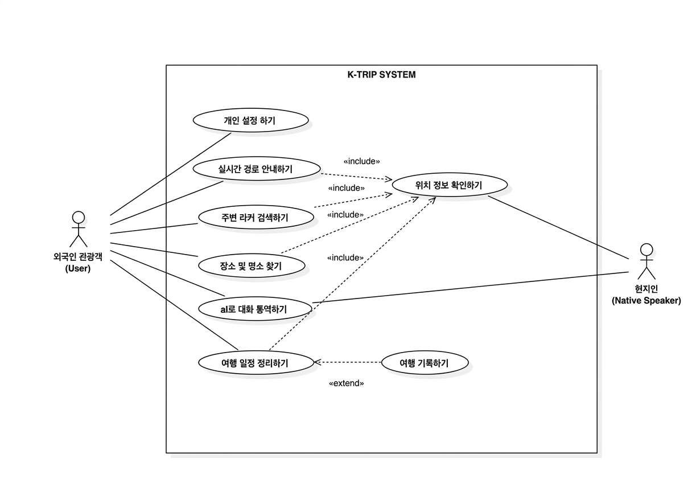
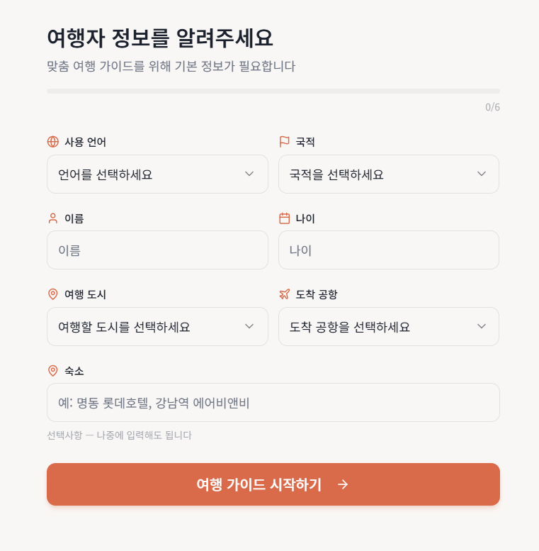
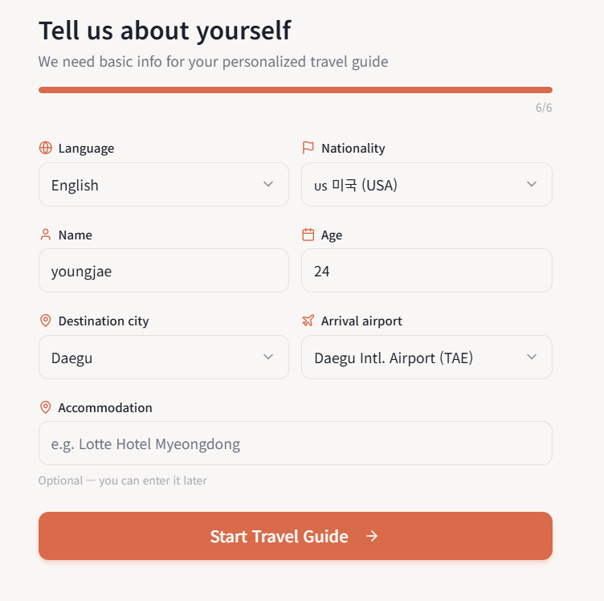
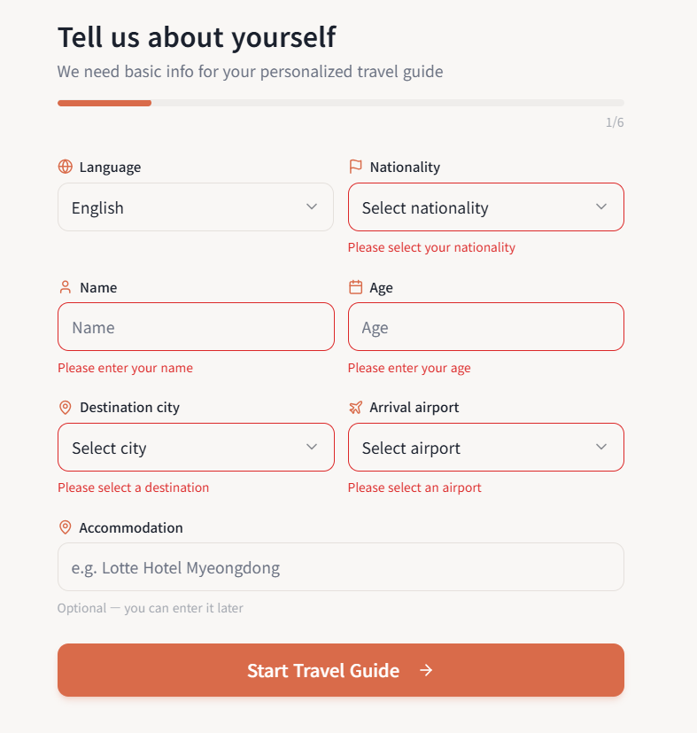
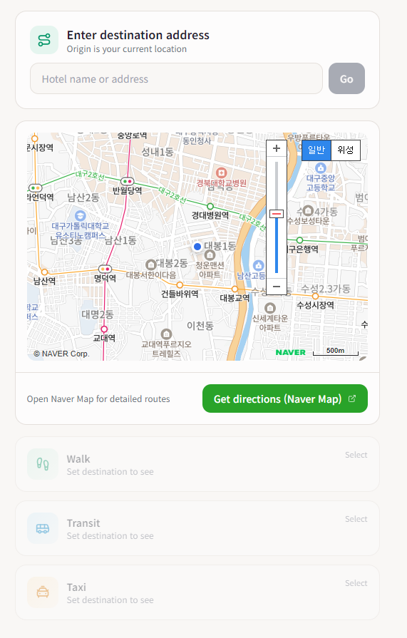
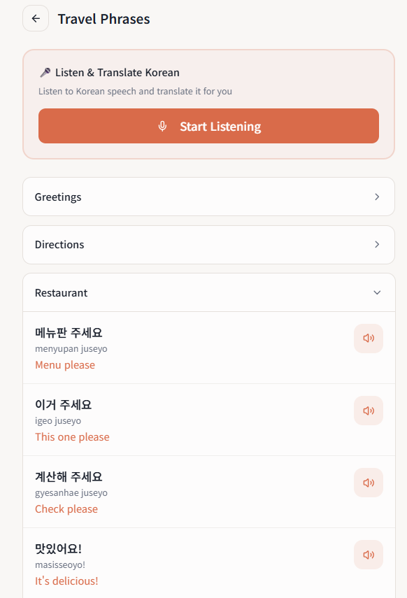
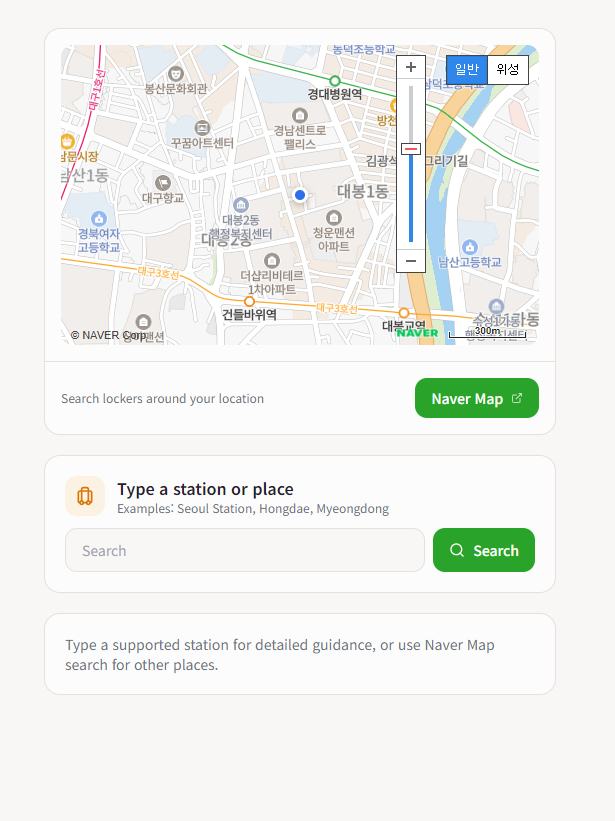
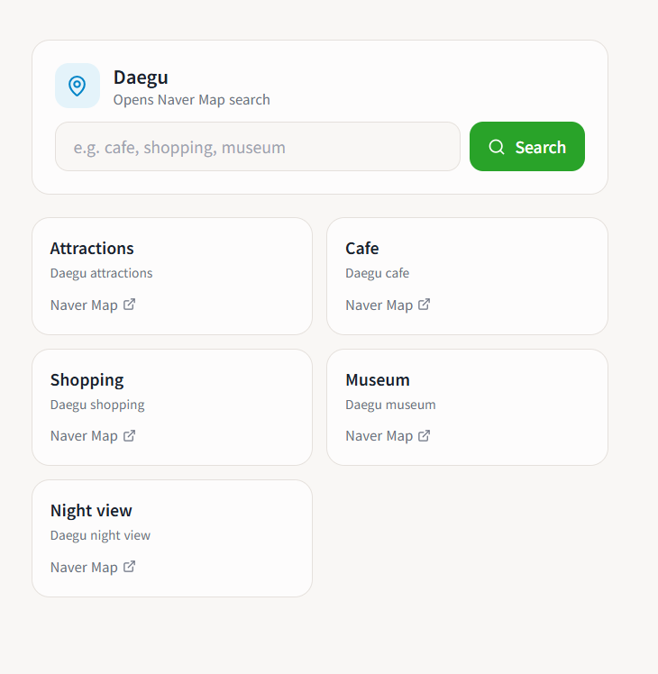

# 한국 여행 통합 가이드 프로그램 [K-Trip] - Analysis Document

## 1. Introduction
본 문서는 K-Trip의 개념 정의(Conceptualization) 단계 이후, 시스템의 세부 동작과 구조를 정의하기 위한 분석(Analysis) 단계 문서입니다.

### 1.1 Summary
한국을 방문하는 외래관광객의 증가에 따라, 언어 장벽과 복잡한 교통 정보를 해결할 통합 가이드 솔루션이 필요합니다. 본 시스템은 개인화된 설정, 스마트 경로 안내, AI 통번역 및 여행 기록 자동화를 통해 관광객에게 최적의 편의를 제공합니다.

### 1.2 Business Goals
- 외국인 관광객의 접근성 및 편의성 극대화
- 실시간 데이터를 활용한 정확한 이동 가이드 제공
- AI 기술을 활용한 언어 장벽 해소
- 여행 경험의 기록 및 공유 자동화

---

### 1.3 Technical Goals
- **High Availability**: 서버 중단 없이 실시간 교통 및 장소 정보를 24/7 제공.
- **Data Integrity**: GPS 로그 및 사용자 개인화 설정 데이터의 유실 없는 관리.
- **Performance**: 대용량 지도 및 이미지 렌더링 최적화로 저사양 기기에서도 부드러운 UX 보장.
- **Scalability**: 증가하는 외래 관광객 트래픽을 처리하기 위한 Supabase/Firebase 기반의 클라우드 인프라 활용.
- **Interoperability**: 공공데이터포털(한국관광공사 등) 및 외부 지도 API와의 원활한 연동.

---

## 2. Use Case Analysis

### 2.1 Use Case Diagram

---

## 2.2 Use Case Specifications

<table style="width: 100%; border-collapse: collapse; border: 1px solid #ddd; margin-bottom: 40px; font-family: sans-serif;">
  <tr style="background-color: #666666; color: white;">
    <th colspan="2" style="padding: 12px; border: 1px solid #ddd; font-size: 1.1em;">Use Case #1 : 개인화 설정 (Personalized Onboarding)</th>
  </tr>
  <tr style="background-color: #666666; color: white;">
    <td colspan="2" style="padding: 8px; border: 1px solid #ddd; font-weight: bold; text-align: center;">General Characteristics</td>
  </tr>
  <tr>
    <td style="width: 25%; padding: 8px; border: 1px solid #ddd; font-weight: bold; background-color: #f2f2f2;">Summary</td>
    <td style="padding: 8px; border: 1px solid #ddd; background-color: #ffffff;">사용자의 국적, 언어, 이름 등 기본 정보를 입력받아 앱 전체 환경을 맞춤형으로 설정한다.</td>
  </tr>
  <tr>
    <td style="padding: 8px; border: 1px solid #ddd; font-weight: bold; background-color: #f2f2f2;">Scope</td>
    <td style="padding: 8px; border: 1px solid #ddd; background-color: #ffffff;">K-Trip 애플리케이션</td>
  </tr>
  <tr>
    <td style="padding: 8px; border: 1px solid #ddd; font-weight: bold; background-color: #f2f2f2;">Level</td>
    <td style="padding: 8px; border: 1px solid #ddd; background-color: #ffffff;">User Goal Level</td>
  </tr>
  <tr>
    <td style="padding: 8px; border: 1px solid #ddd; font-weight: bold; background-color: #f2f2f2;">Primary Actor</td>
    <td style="padding: 8px; border: 1px solid #ddd; background-color: #ffffff;">외래관광객 (User)</td>
  </tr>
  <tr>
    <td style="padding: 8px; border: 1px solid #ddd; font-weight: bold; background-color: #f2f2f2;">Preconditions</td>
    <td style="padding: 8px; border: 1px solid #ddd; background-color: #ffffff;">앱 설치 및 네트워크 연결 활성 상태</td>
  </tr>
  <tr>
    <td style="padding: 8px; border: 1px solid #ddd; font-weight: bold; background-color: #f2f2f2;">Trigger</td>
    <td style="padding: 8px; border: 1px solid #ddd; background-color: #ffffff;">앱 설치 후 최초 실행 또는 설정 메뉴의 '프로필 수정' 진입</td>
  </tr>
  <tr>
    <td style="padding: 8px; border: 1px solid #ddd; font-weight: bold; background-color: #f2f2f2;">Success Post-condition</td>
    <td style="padding: 8px; border: 1px solid #ddd; background-color: #ffffff;">사용자 언어로 UI가 즉시 변경되고 프로필 데이터가 서버/로컬 DB에 저장됨.</td>
  </tr>
  <tr>
    <td style="padding: 8px; border: 1px solid #ddd; font-weight: bold; background-color: #f2f2f2;">Failed Post-condition</td>
    <td style="padding: 8px; border: 1px solid #ddd; background-color: #ffffff;">설정 정보가 저장되지 않고 초기화 상태로 유지됨.</td>
  </tr>
  <tr style="background-color: #666666; color: white;">
    <td colspan="2" style="padding: 8px; border: 1px solid #ddd; font-weight: bold; text-align: center;">Main Success Scenario</td>
  </tr>
  <tr style="background-color: #f2f2f2;">
    <td style="padding: 8px; border: 1px solid #ddd; font-weight: bold; text-align: center;">Step</td>
    <td style="padding: 8px; border: 1px solid #ddd; font-weight: bold; text-align: center;">Action</td>
  </tr>

  <tr>
    <td style="text-align: center; border: 1px solid #ddd; background-color: #f2f2f2; font-weight: bold;">1</td>
    <td style="padding: 8px; border: 1px solid #ddd; background-color: #ffffff;">시스템이 초기 설정 화면을 표시한다.</td>
  </tr>
  <tr>
    <td style="text-align: center; border: 1px solid #ddd; background-color: #f2f2f2; font-weight: bold;">2</td>
    <td style="padding: 8px; border: 1px solid #ddd; background-color: #ffffff;">사용자가 이름, 나이, 국적 등을 입력하고 언어를 선택한다.</td>
  </tr>
  <tr>
    <td style="text-align: center; border: 1px solid #ddd; background-color: #f2f2f2; font-weight: bold;">3</td>
    <td style="padding: 8px; border: 1px solid #ddd; background-color: #ffffff;">사용자가 '설정 완료' 버튼을 클릭한다.</td>
  </tr>
  <tr>
    <td style="text-align: center; border: 1px solid #ddd; background-color: #f2f2f2; font-weight: bold;">4</td>
    <td style="padding: 8px; border: 1px solid #ddd; background-color: #ffffff;">시스템이 데이터를 검증하고 DB에 저장한다.</td>
  </tr>
  <tr>
    <td style="text-align: center; border: 1px solid #ddd; background-color: #f2f2f2; font-weight: bold;">5</td>
    <td style="padding: 8px; border: 1px solid #ddd; background-color: #ffffff;">시스템이 UI 리소스를 언어에 맞춰 리로드한다.</td>
  </tr>
  <tr style="background-color: #666666; color: white;">
    <td colspan="2" style="padding: 8px; border: 1px solid #ddd; font-weight: bold; text-align: center;">Extension Scenarios</td>
  </tr>
  <tr style="background-color: #f2f2f2;">
    <td style="padding: 8px; border: 1px solid #ddd; font-weight: bold; text-align: center;">Step</td>
    <td style="padding: 8px; border: 1px solid #ddd; font-weight: bold; text-align: center;">Branching Action</td>
  </tr>

  <tr>
    <td style="text-align: center; border: 1px solid #ddd; background-color: #f2f2f2; font-weight: bold;">3a</td>
    <td style="padding: 8px; border: 1px solid #ddd; background-color: #ffffff;">필수 정보 누락 시 경고 메시지 출력 및 재입력 유도.</td>
  </tr>
  <tr>
    <td style="text-align: center; border: 1px solid #ddd; background-color: #f2f2f2; font-weight: bold;">4a</td>
    <td style="padding: 8px; border: 1px solid #ddd; background-color: #ffffff;">네트워크 오류 시 로컬 우선 저장 후 추후 동기화 안내.</td>
  </tr>
  <tr style="background-color: #666666; color: white;">
    <td colspan="2" style="padding: 8px; border: 1px solid #ddd; font-weight: bold; text-align: center;">Related Information</td>
  </tr>
  <tr>
    <td style="padding: 8px; border: 1px solid #ddd; font-weight: bold; background-color: #f2f2f2;">Performance</td>
    <td style="padding: 8px; border: 1px solid #ddd; background-color: #ffffff;">언어 전환 완료까지 1.5초 이내</td>
  </tr>
  <tr>
    <td style="padding: 8px; border: 1px solid #ddd; font-weight: bold; background-color: #f2f2f2;">Due Date</td>
    <td style="padding: 8px; border: 1px solid #ddd; background-color: #ffffff;">2026-05-20</td>
  </tr>
</table>

<table style="width: 100%; border-collapse: collapse; border: 1px solid #ddd; margin-bottom: 40px; font-family: sans-serif;">
  <tr style="background-color: #666666; color: white;">
    <th colspan="2" style="padding: 12px; border: 1px solid #ddd; font-size: 1.1em;">Use Case #2 : 스마트 이동 가이드 (Navigation Guide)</th>
  </tr>
  <tr style="background-color: #666666; color: white;">
    <td colspan="2" style="padding: 8px; border: 1px solid #ddd; font-weight: bold; text-align: center;">General Characteristics</td>
  </tr>
  <tr>
    <td style="width: 25%; padding: 8px; border: 1px solid #ddd; font-weight: bold; background-color: #f2f2f2;">Summary</td>
    <td style="padding: 8px; border: 1px solid #ddd; background-color: #ffffff;">현재 위치를 기반으로 숙소 또는 목적지까지의 최적 경로, 비용, 동선을 안내한다.</td>
  </tr>
  <tr>
    <td style="padding: 8px; border: 1px solid #ddd; font-weight: bold; background-color: #f2f2f2;">Scope</td>
    <td style="padding: 8px; border: 1px solid #ddd; background-color: #ffffff;">K-Trip 애플리케이션</td>
  </tr>
  <tr>
    <td style="padding: 8px; border: 1px solid #ddd; font-weight: bold; background-color: #f2f2f2;">Level</td>
    <td style="padding: 8px; border: 1px solid #ddd; background-color: #ffffff;">User Goal Level</td>
  </tr>
  <tr>
    <td style="padding: 8px; border: 1px solid #ddd; font-weight: bold; background-color: #f2f2f2;">Primary Actor</td>
    <td style="padding: 8px; border: 1px solid #ddd; background-color: #ffffff;">외래관광객 (User)</td>
  </tr>
  <tr>
    <td style="padding: 8px; border: 1px solid #ddd; font-weight: bold; background-color: #f2f2f2;">Preconditions</td>
    <td style="padding: 8px; border: 1px solid #ddd; background-color: #ffffff;">앱 설치 및 네트워크 연결 활성 상태</td>
  </tr>
  <tr>
    <td style="padding: 8px; border: 1px solid #ddd; font-weight: bold; background-color: #f2f2f2;">Trigger</td>
    <td style="padding: 8px; border: 1px solid #ddd; background-color: #ffffff;">목적지 검색 또는 'Go Home' 단축 버튼 클릭</td>
  </tr>
  <tr>
    <td style="padding: 8px; border: 1px solid #ddd; font-weight: bold; background-color: #f2f2f2;">Success Post-condition</td>
    <td style="padding: 8px; border: 1px solid #ddd; background-color: #ffffff;">최적 경로 가이드가 화면에 표시되고 안내가 시작됨.</td>
  </tr>
  <tr>
    <td style="padding: 8px; border: 1px solid #ddd; font-weight: bold; background-color: #f2f2f2;">Failed Post-condition</td>
    <td style="padding: 8px; border: 1px solid #ddd; background-color: #ffffff;">경로 탐색 실패 메시지 출력 및 메인 화면 유지.</td>
  </tr>
  <tr style="background-color: #666666; color: white;">
    <td colspan="2" style="padding: 8px; border: 1px solid #ddd; font-weight: bold; text-align: center;">Main Success Scenario</td>
  </tr>
  <tr style="background-color: #f2f2f2;">
    <td style="padding: 8px; border: 1px solid #ddd; font-weight: bold; text-align: center;">Step</td>
    <td style="padding: 8px; border: 1px solid #ddd; font-weight: bold; text-align: center;">Action</td>
  </tr>

  <tr>
    <td style="text-align: center; border: 1px solid #ddd; background-color: #f2f2f2; font-weight: bold;">1</td>
    <td style="padding: 8px; border: 1px solid #ddd; background-color: #ffffff;">사용자가 목적지를 입력하거나 숙소 버튼을 클릭한다.</td>
  </tr>
  <tr>
    <td style="text-align: center; border: 1px solid #ddd; background-color: #f2f2f2; font-weight: bold;">2</td>
    <td style="padding: 8px; border: 1px solid #ddd; background-color: #ffffff;">시스템이 좌표를 확인하고 교통 데이터를 수집한다.</td>
  </tr>
  <tr>
    <td style="text-align: center; border: 1px solid #ddd; background-color: #f2f2f2; font-weight: bold;">3</td>
    <td style="padding: 8px; border: 1px solid #ddd; background-color: #ffffff;">시스템이 택시 및 대중교통 경로 리스트를 출력한다.</td>
  </tr>
  <tr>
    <td style="text-align: center; border: 1px solid #ddd; background-color: #f2f2f2; font-weight: bold;">4</td>
    <td style="padding: 8px; border: 1px solid #ddd; background-color: #ffffff;">사용자가 특정 경로를 선택한다.</td>
  </tr>
  <tr>
    <td style="text-align: center; border: 1px solid #ddd; background-color: #f2f2f2; font-weight: bold;">5</td>
    <td style="padding: 8px; border: 1px solid #ddd; background-color: #ffffff;">상세 가이드와 실시간 안내를 시작한다.</td>
  </tr>
  <tr style="background-color: #666666; color: white;">
    <td colspan="2" style="padding: 8px; border: 1px solid #ddd; font-weight: bold; text-align: center;">Extension Scenarios</td>
  </tr>
  <tr style="background-color: #f2f2f2;">
    <td style="padding: 8px; border: 1px solid #ddd; font-weight: bold; text-align: center;">Step</td>
    <td style="padding: 8px; border: 1px solid #ddd; font-weight: bold; text-align: center;">Branching Action</td>
  </tr>

  <tr>
    <td style="text-align: center; border: 1px solid #ddd; background-color: #f2f2f2; font-weight: bold;">1a</td>
    <td style="padding: 8px; border: 1px solid #ddd; background-color: #ffffff;">숙소 미등록 시 등록 화면 이동 제안.</td>
  </tr>
  <tr>
    <td style="text-align: center; border: 1px solid #ddd; background-color: #f2f2f2; font-weight: bold;">2a</td>
    <td style="padding: 8px; border: 1px solid #ddd; background-color: #ffffff;">GPS 수신 불량 시 위치 수동 설정 모드 활성화.</td>
  </tr>
  <tr style="background-color: #666666; color: white;">
    <td colspan="2" style="padding: 8px; border: 1px solid #ddd; font-weight: bold; text-align: center;">Related Information</td>
  </tr>
  <tr>
    <td style="padding: 8px; border: 1px solid #ddd; font-weight: bold; background-color: #f2f2f2;">Performance</td>
    <td style="padding: 8px; border: 1px solid #ddd; background-color: #ffffff;">경로 탐색 결과 출력까지 3초 이내</td>
  </tr>
  <tr>
    <td style="padding: 8px; border: 1px solid #ddd; font-weight: bold; background-color: #f2f2f2;">Due Date</td>
    <td style="padding: 8px; border: 1px solid #ddd; background-color: #ffffff;">2026-05-25</td>
  </tr>
</table>

<table style="width: 100%; border-collapse: collapse; border: 1px solid #ddd; margin-bottom: 40px; font-family: sans-serif;">
  <tr style="background-color: #666666; color: white;">
    <th colspan="2" style="padding: 12px; border: 1px solid #ddd; font-size: 1.1em;">Use Case #3 : AI 실시간 회화 (AI Interpretation)</th>
  </tr>
  <tr style="background-color: #666666; color: white;">
    <td colspan="2" style="padding: 8px; border: 1px solid #ddd; font-weight: bold; text-align: center;">General Characteristics</td>
  </tr>
  <tr>
    <td style="width: 25%; padding: 8px; border: 1px solid #ddd; font-weight: bold; background-color: #f2f2f2;">Summary</td>
    <td style="padding: 8px; border: 1px solid #ddd; background-color: #ffffff;">상황별 문구를 한국어로 출력하고, 현지인의 답변을 번역하여 제공한다.</td>
  </tr>
  <tr>
    <td style="padding: 8px; border: 1px solid #ddd; font-weight: bold; background-color: #f2f2f2;">Scope</td>
    <td style="padding: 8px; border: 1px solid #ddd; background-color: #ffffff;">K-Trip 애플리케이션</td>
  </tr>
  <tr>
    <td style="padding: 8px; border: 1px solid #ddd; font-weight: bold; background-color: #f2f2f2;">Level</td>
    <td style="padding: 8px; border: 1px solid #ddd; background-color: #ffffff;">User Goal Level</td>
  </tr>
  <tr>
    <td style="padding: 8px; border: 1px solid #ddd; font-weight: bold; background-color: #f2f2f2;">Primary Actor</td>
    <td style="padding: 8px; border: 1px solid #ddd; background-color: #ffffff;">외래관광객 (User)</td>
  </tr>
  <tr>
    <td style="padding: 8px; border: 1px solid #ddd; font-weight: bold; background-color: #f2f2f2;">Preconditions</td>
    <td style="padding: 8px; border: 1px solid #ddd; background-color: #ffffff;">앱 설치 및 네트워크 연결 활성 상태</td>
  </tr>
  <tr>
    <td style="padding: 8px; border: 1px solid #ddd; font-weight: bold; background-color: #f2f2f2;">Trigger</td>
    <td style="padding: 8px; border: 1px solid #ddd; background-color: #ffffff;">하단 메뉴의 'Interpretation' 아이콘 클릭</td>
  </tr>
  <tr>
    <td style="padding: 8px; border: 1px solid #ddd; font-weight: bold; background-color: #f2f2f2;">Success Post-condition</td>
    <td style="padding: 8px; border: 1px solid #ddd; background-color: #ffffff;">대화 내용이 실시간 번역되어 화면에 표시됨.</td>
  </tr>
  <tr>
    <td style="padding: 8px; border: 1px solid #ddd; font-weight: bold; background-color: #f2f2f2;">Failed Post-condition</td>
    <td style="padding: 8px; border: 1px solid #ddd; background-color: #ffffff;">음성 인식 또는 번역 오류 메시지 출력.</td>
  </tr>
  <tr style="background-color: #666666; color: white;">
    <td colspan="2" style="padding: 8px; border: 1px solid #ddd; font-weight: bold; text-align: center;">Main Success Scenario</td>
  </tr>
  <tr style="background-color: #f2f2f2;">
    <td style="padding: 8px; border: 1px solid #ddd; font-weight: bold; text-align: center;">Step</td>
    <td style="padding: 8px; border: 1px solid #ddd; font-weight: bold; text-align: center;">Action</td>
  </tr>

  <tr>
    <td style="text-align: center; border: 1px solid #ddd; background-color: #f2f2f2; font-weight: bold;">1</td>
    <td style="padding: 8px; border: 1px solid #ddd; background-color: #ffffff;">사용자가 상황별 카테고리에서 문구를 선택한다.</td>
  </tr>
  <tr>
    <td style="text-align: center; border: 1px solid #ddd; background-color: #f2f2f2; font-weight: bold;">2</td>
    <td style="padding: 8px; border: 1px solid #ddd; background-color: #ffffff;">시스템이 해당 문구를 한국어로 음성 출력한다.</td>
  </tr>
  <tr>
    <td style="text-align: center; border: 1px solid #ddd; background-color: #f2f2f2; font-weight: bold;">3</td>
    <td style="padding: 8px; border: 1px solid #ddd; background-color: #ffffff;">시스템이 자동으로 답변 청취 모드를 활성화한다.</td>
  </tr>
  <tr>
    <td style="text-align: center; border: 1px solid #ddd; background-color: #f2f2f2; font-weight: bold;">4</td>
    <td style="padding: 8px; border: 1px solid #ddd; background-color: #ffffff;">현지인 답변을 청취하고 STT 분석을 수행한다.</td>
  </tr>
  <tr>
    <td style="text-align: center; border: 1px solid #ddd; background-color: #f2f2f2; font-weight: bold;">5</td>
    <td style="padding: 8px; border: 1px solid #ddd; background-color: #ffffff;">번역된 내용을 채팅 형태로 표시한다.</td>
  </tr>
  <tr style="background-color: #666666; color: white;">
    <td colspan="2" style="padding: 8px; border: 1px solid #ddd; font-weight: bold; text-align: center;">Extension Scenarios</td>
  </tr>
  <tr style="background-color: #f2f2f2;">
    <td style="padding: 8px; border: 1px solid #ddd; font-weight: bold; text-align: center;">Step</td>
    <td style="padding: 8px; border: 1px solid #ddd; font-weight: bold; text-align: center;">Branching Action</td>
  </tr>

  <tr>
    <td style="text-align: center; border: 1px solid #ddd; background-color: #f2f2f2; font-weight: bold;">4a</td>
    <td style="padding: 8px; border: 1px solid #ddd; background-color: #ffffff;">인식 실패 시 재입력 가이드 표시.</td>
  </tr>
  <tr>
    <td style="text-align: center; border: 1px solid #ddd; background-color: #f2f2f2; font-weight: bold;">5a</td>
    <td style="padding: 8px; border: 1px solid #ddd; background-color: #ffffff;">번역 엔진 오류 시 직접 입력 모드 전환.</td>
  </tr>
  <tr style="background-color: #666666; color: white;">
    <td colspan="2" style="padding: 8px; border: 1px solid #ddd; font-weight: bold; text-align: center;">Related Information</td>
  </tr>
  <tr>
    <td style="padding: 8px; border: 1px solid #ddd; font-weight: bold; background-color: #f2f2f2;">Performance</td>
    <td style="padding: 8px; border: 1px solid #ddd; background-color: #ffffff;">번역 완료까지 2초 이내</td>
  </tr>
  <tr>
    <td style="padding: 8px; border: 1px solid #ddd; font-weight: bold; background-color: #f2f2f2;">Due Date</td>
    <td style="padding: 8px; border: 1px solid #ddd; background-color: #ffffff;">2026-05-30</td>
  </tr>
</table>

<table style="width: 100%; border-collapse: collapse; border: 1px solid #ddd; margin-bottom: 40px; font-family: sans-serif;">
  <tr style="background-color: #666666; color: white;">
    <th colspan="2" style="padding: 12px; border: 1px solid #ddd; font-size: 1.1em;">Use Case #4 : 나만의 지도 (Travel Logging & Video)</th>
  </tr>
  <tr style="background-color: #666666; color: white;">
    <td colspan="2" style="padding: 8px; border: 1px solid #ddd; font-weight: bold; text-align: center;">General Characteristics</td>
  </tr>
  <tr>
    <td style="width: 25%; padding: 8px; border: 1px solid #ddd; font-weight: bold; background-color: #f2f2f2;">Summary</td>
    <td style="padding: 8px; border: 1px solid #ddd; background-color: #ffffff;">이동 GPS 경로를 기록하고 촬영한 사진을 결합하여 여행 영상을 자동 제작한다.</td>
  </tr>
  <tr>
    <td style="padding: 8px; border: 1px solid #ddd; font-weight: bold; background-color: #f2f2f2;">Scope</td>
    <td style="padding: 8px; border: 1px solid #ddd; background-color: #ffffff;">K-Trip 애플리케이션</td>
  </tr>
  <tr>
    <td style="padding: 8px; border: 1px solid #ddd; font-weight: bold; background-color: #f2f2f2;">Level</td>
    <td style="padding: 8px; border: 1px solid #ddd; background-color: #ffffff;">User Goal Level</td>
  </tr>
  <tr>
    <td style="padding: 8px; border: 1px solid #ddd; font-weight: bold; background-color: #f2f2f2;">Primary Actor</td>
    <td style="padding: 8px; border: 1px solid #ddd; background-color: #ffffff;">외래관광객 (User)</td>
  </tr>
  <tr>
    <td style="padding: 8px; border: 1px solid #ddd; font-weight: bold; background-color: #f2f2f2;">Preconditions</td>
    <td style="padding: 8px; border: 1px solid #ddd; background-color: #ffffff;">앱 설치 및 네트워크 연결 활성 상태</td>
  </tr>
  <tr>
    <td style="padding: 8px; border: 1px solid #ddd; font-weight: bold; background-color: #f2f2f2;">Trigger</td>
    <td style="padding: 8px; border: 1px solid #ddd; background-color: #ffffff;">일정 종료 시 제안 또는 사용자의 영상 생성 요청</td>
  </tr>
  <tr>
    <td style="padding: 8px; border: 1px solid #ddd; font-weight: bold; background-color: #f2f2f2;">Success Post-condition</td>
    <td style="padding: 8px; border: 1px solid #ddd; background-color: #ffffff;">자동 편집된 영상이 로컬 갤러리에 저장됨.</td>
  </tr>
  <tr>
    <td style="padding: 8px; border: 1px solid #ddd; font-weight: bold; background-color: #f2f2f2;">Failed Post-condition</td>
    <td style="padding: 8px; border: 1px solid #ddd; background-color: #ffffff;">영상 제작 실패 알림 및 원본 데이터 유지.</td>
  </tr>
  <tr style="background-color: #666666; color: white;">
    <td colspan="2" style="padding: 8px; border: 1px solid #ddd; font-weight: bold; text-align: center;">Main Success Scenario</td>
  </tr>
  <tr style="background-color: #f2f2f2;">
    <td style="padding: 8px; border: 1px solid #ddd; font-weight: bold; text-align: center;">Step</td>
    <td style="padding: 8px; border: 1px solid #ddd; font-weight: bold; text-align: center;">Action</td>
  </tr>

  <tr>
    <td style="text-align: center; border: 1px solid #ddd; background-color: #f2f2f2; font-weight: bold;">1</td>
    <td style="padding: 8px; border: 1px solid #ddd; background-color: #ffffff;">시스템이 백그라운드에서 실시간 GPS 경로를 기록한다.</td>
  </tr>
  <tr>
    <td style="text-align: center; border: 1px solid #ddd; background-color: #f2f2f2; font-weight: bold;">2</td>
    <td style="padding: 8px; border: 1px solid #ddd; background-color: #ffffff;">사용자가 장소에서 사진/영상을 촬영한다.</td>
  </tr>
  <tr>
    <td style="text-align: center; border: 1px solid #ddd; background-color: #f2f2f2; font-weight: bold;">3</td>
    <td style="padding: 8px; border: 1px solid #ddd; background-color: #ffffff;">시스템이 미디어 메타데이터를 경로상에 매칭한다.</td>
  </tr>
  <tr>
    <td style="text-align: center; border: 1px solid #ddd; background-color: #f2f2f2; font-weight: bold;">4</td>
    <td style="padding: 8px; border: 1px solid #ddd; background-color: #ffffff;">사용자가 '영상 생성'을 선택한다.</td>
  </tr>
  <tr>
    <td style="text-align: center; border: 1px solid #ddd; background-color: #f2f2f2; font-weight: bold;">5</td>
    <td style="padding: 8px; border: 1px solid #ddd; background-color: #ffffff;">지도 애니메이션과 미디어를 결합하여 인코딩한다.</td>
  </tr>
  <tr style="background-color: #666666; color: white;">
    <td colspan="2" style="padding: 8px; border: 1px solid #ddd; font-weight: bold; text-align: center;">Extension Scenarios</td>
  </tr>
  <tr style="background-color: #f2f2f2;">
    <td style="padding: 8px; border: 1px solid #ddd; font-weight: bold; text-align: center;">Step</td>
    <td style="padding: 8px; border: 1px solid #ddd; font-weight: bold; text-align: center;">Branching Action</td>
  </tr>

  <tr>
    <td style="text-align: center; border: 1px solid #ddd; background-color: #f2f2f2; font-weight: bold;">2a</td>
    <td style="padding: 8px; border: 1px solid #ddd; background-color: #ffffff;">미디어 없음 시 경로 애니메이션 위주로 제작.</td>
  </tr>
  <tr>
    <td style="text-align: center; border: 1px solid #ddd; background-color: #f2f2f2; font-weight: bold;">5a</td>
    <td style="padding: 8px; border: 1px solid #ddd; background-color: #ffffff;">용량 부족 시 저장 공간 확보 안내.</td>
  </tr>
  <tr style="background-color: #666666; color: white;">
    <td colspan="2" style="padding: 8px; border: 1px solid #ddd; font-weight: bold; text-align: center;">Related Information</td>
  </tr>
  <tr>
    <td style="padding: 8px; border: 1px solid #ddd; font-weight: bold; background-color: #f2f2f2;">Performance</td>
    <td style="padding: 8px; border: 1px solid #ddd; background-color: #ffffff;">미리보기 생성까지 30초 이내</td>
  </tr>
  <tr>
    <td style="padding: 8px; border: 1px solid #ddd; font-weight: bold; background-color: #f2f2f2;">Due Date</td>
    <td style="padding: 8px; border: 1px solid #ddd; background-color: #ffffff;">2026-06-05</td>
  </tr>
</table>

<table style="width: 100%; border-collapse: collapse; border: 1px solid #ddd; margin-bottom: 40px; font-family: sans-serif;">
  <tr style="background-color: #666666; color: white;">
    <th colspan="2" style="padding: 12px; border: 1px solid #ddd; font-size: 1.1em;">Use Case #5 : 역내 라커 위치 찾기 (Locker Finder)</th>
  </tr>
  <tr style="background-color: #666666; color: white;">
    <td colspan="2" style="padding: 8px; border: 1px solid #ddd; font-weight: bold; text-align: center;">General Characteristics</td>
  </tr>
  <tr>
    <td style="width: 25%; padding: 8px; border: 1px solid #ddd; font-weight: bold; background-color: #f2f2f2;">Summary</td>
    <td style="padding: 8px; border: 1px solid #ddd; background-color: #ffffff;">지하철 역사 내부의 보관함 위치와 이용 상태를 시각적으로 안내한다.</td>
  </tr>
  <tr>
    <td style="padding: 8px; border: 1px solid #ddd; font-weight: bold; background-color: #f2f2f2;">Scope</td>
    <td style="padding: 8px; border: 1px solid #ddd; background-color: #ffffff;">K-Trip 애플리케이션</td>
  </tr>
  <tr>
    <td style="padding: 8px; border: 1px solid #ddd; font-weight: bold; background-color: #f2f2f2;">Level</td>
    <td style="padding: 8px; border: 1px solid #ddd; background-color: #ffffff;">User Goal Level</td>
  </tr>
  <tr>
    <td style="padding: 8px; border: 1px solid #ddd; font-weight: bold; background-color: #f2f2f2;">Primary Actor</td>
    <td style="padding: 8px; border: 1px solid #ddd; background-color: #ffffff;">외래관광객 (User)</td>
  </tr>
  <tr>
    <td style="padding: 8px; border: 1px solid #ddd; font-weight: bold; background-color: #f2f2f2;">Preconditions</td>
    <td style="padding: 8px; border: 1px solid #ddd; background-color: #ffffff;">앱 설치 및 네트워크 연결 활성 상태</td>
  </tr>
  <tr>
    <td style="padding: 8px; border: 1px solid #ddd; font-weight: bold; background-color: #f2f2f2;">Trigger</td>
    <td style="padding: 8px; border: 1px solid #ddd; background-color: #ffffff;">메뉴 내 'Locker' 필터 클릭</td>
  </tr>
  <tr>
    <td style="padding: 8px; border: 1px solid #ddd; font-weight: bold; background-color: #f2f2f2;">Success Post-condition</td>
    <td style="padding: 8px; border: 1px solid #ddd; background-color: #ffffff;">역사 도면 위에 라커 위치가 핀으로 표시됨.</td>
  </tr>
  <tr>
    <td style="padding: 8px; border: 1px solid #ddd; font-weight: bold; background-color: #f2f2f2;">Failed Post-condition</td>
    <td style="padding: 8px; border: 1px solid #ddd; background-color: #ffffff;">해당 역 정보 없음 안내.</td>
  </tr>
  <tr style="background-color: #666666; color: white;">
    <td colspan="2" style="padding: 8px; border: 1px solid #ddd; font-weight: bold; text-align: center;">Main Success Scenario</td>
  </tr>
  <tr style="background-color: #f2f2f2;">
    <td style="padding: 8px; border: 1px solid #ddd; font-weight: bold; text-align: center;">Step</td>
    <td style="padding: 8px; border: 1px solid #ddd; font-weight: bold; text-align: center;">Action</td>
  </tr>

  <tr>
    <td style="text-align: center; border: 1px solid #ddd; background-color: #f2f2f2; font-weight: bold;">1</td>
    <td style="padding: 8px; border: 1px solid #ddd; background-color: #ffffff;">사용자가 메뉴에서 'Locker' 기능을 선택한다.</td>
  </tr>
  <tr>
    <td style="text-align: center; border: 1px solid #ddd; background-color: #f2f2f2; font-weight: bold;">2</td>
    <td style="padding: 8px; border: 1px solid #ddd; background-color: #ffffff;">시스템이 인접 지하철역 도면을 로드한다.</td>
  </tr>
  <tr>
    <td style="text-align: center; border: 1px solid #ddd; background-color: #f2f2f2; font-weight: bold;">3</td>
    <td style="padding: 8px; border: 1px solid #ddd; background-color: #ffffff;">보관함 위치와 상세 가이드를 표시한다.</td>
  </tr>
  <tr>
    <td style="text-align: center; border: 1px solid #ddd; background-color: #f2f2f2; font-weight: bold;">4</td>
    <td style="padding: 8px; border: 1px solid #ddd; background-color: #ffffff;">클릭 시 요금 및 상태 정보를 팝업으로 제공한다.</td>
  </tr>
  <tr>
    <td style="text-align: center; border: 1px solid #ddd; background-color: #f2f2f2; font-weight: bold;">5</td>
    <td style="padding: 8px; border: 1px solid #ddd; background-color: #ffffff;">보행 가이드라인을 화면에 오버레이한다.</td>
  </tr>
  <tr style="background-color: #666666; color: white;">
    <td colspan="2" style="padding: 8px; border: 1px solid #ddd; font-weight: bold; text-align: center;">Extension Scenarios</td>
  </tr>
  <tr style="background-color: #f2f2f2;">
    <td style="padding: 8px; border: 1px solid #ddd; font-weight: bold; text-align: center;">Step</td>
    <td style="padding: 8px; border: 1px solid #ddd; font-weight: bold; text-align: center;">Branching Action</td>
  </tr>

  <tr>
    <td style="text-align: center; border: 1px solid #ddd; background-color: #f2f2f2; font-weight: bold;">2a</td>
    <td style="padding: 8px; border: 1px solid #ddd; background-color: #ffffff;">도면 데이터 없음 시 일반 지도로 대체 안내.</td>
  </tr>
  <tr style="background-color: #666666; color: white;">
    <td colspan="2" style="padding: 8px; border: 1px solid #ddd; font-weight: bold; text-align: center;">Related Information</td>
  </tr>
  <tr>
    <td style="padding: 8px; border: 1px solid #ddd; font-weight: bold; background-color: #f2f2f2;">Performance</td>
    <td style="padding: 8px; border: 1px solid #ddd; background-color: #ffffff;">위치 핀 출력까지 1초 이내</td>
  </tr>
  <tr>
    <td style="padding: 8px; border: 1px solid #ddd; font-weight: bold; background-color: #f2f2f2;">Due Date</td>
    <td style="padding: 8px; border: 1px solid #ddd; background-color: #ffffff;">2026-05-22</td>
  </tr>
</table>

<table style="width: 100%; border-collapse: collapse; border: 1px solid #ddd; margin-bottom: 40px; font-family: sans-serif;">
  <tr style="background-color: #666666; color: white;">
    <th colspan="2" style="padding: 12px; border: 1px solid #ddd; font-size: 1.1em;">Use Case #6 : 장소 검색 (Place Search)</th>
  </tr>
  <tr style="background-color: #666666; color: white;">
    <td colspan="2" style="padding: 8px; border: 1px solid #ddd; font-weight: bold; text-align: center;">General Characteristics</td>
  </tr>
  <tr>
    <td style="width: 25%; padding: 8px; border: 1px solid #ddd; font-weight: bold; background-color: #f2f2f2;">Summary</td>
    <td style="padding: 8px; border: 1px solid #ddd; background-color: #ffffff;">특정 관광지나 시설을 검색하여 상세 정보 및 리뷰를 확인한다.</td>
  </tr>
  <tr>
    <td style="padding: 8px; border: 1px solid #ddd; font-weight: bold; background-color: #f2f2f2;">Scope</td>
    <td style="padding: 8px; border: 1px solid #ddd; background-color: #ffffff;">K-Trip 애플리케이션</td>
  </tr>
  <tr>
    <td style="padding: 8px; border: 1px solid #ddd; font-weight: bold; background-color: #f2f2f2;">Level</td>
    <td style="padding: 8px; border: 1px solid #ddd; background-color: #ffffff;">User Goal Level</td>
  </tr>
  <tr>
    <td style="padding: 8px; border: 1px solid #ddd; font-weight: bold; background-color: #f2f2f2;">Primary Actor</td>
    <td style="padding: 8px; border: 1px solid #ddd; background-color: #ffffff;">외래관광객 (User)</td>
  </tr>
  <tr>
    <td style="padding: 8px; border: 1px solid #ddd; font-weight: bold; background-color: #f2f2f2;">Preconditions</td>
    <td style="padding: 8px; border: 1px solid #ddd; background-color: #ffffff;">앱 설치 및 네트워크 연결 활성 상태</td>
  </tr>
  <tr>
    <td style="padding: 8px; border: 1px solid #ddd; font-weight: bold; background-color: #f2f2f2;">Trigger</td>
    <td style="padding: 8px; border: 1px solid #ddd; background-color: #ffffff;">검색창 입력 또는 지도 마커 클릭</td>
  </tr>
  <tr>
    <td style="padding: 8px; border: 1px solid #ddd; font-weight: bold; background-color: #f2f2f2;">Success Post-condition</td>
    <td style="padding: 8px; border: 1px solid #ddd; background-color: #ffffff;">장소 상세 페이지가 언어에 맞춰 출력됨.</td>
  </tr>
  <tr>
    <td style="padding: 8px; border: 1px solid #ddd; font-weight: bold; background-color: #f2f2f2;">Failed Post-condition</td>
    <td style="padding: 8px; border: 1px solid #ddd; background-color: #ffffff;">장소 정보 로딩 실패 메시지 출력.</td>
  </tr>
  <tr style="background-color: #666666; color: white;">
    <td colspan="2" style="padding: 8px; border: 1px solid #ddd; font-weight: bold; text-align: center;">Main Success Scenario</td>
  </tr>
  <tr style="background-color: #f2f2f2;">
    <td style="padding: 8px; border: 1px solid #ddd; font-weight: bold; text-align: center;">Step</td>
    <td style="padding: 8px; border: 1px solid #ddd; font-weight: bold; text-align: center;">Action</td>
  </tr>

  <tr>
    <td style="text-align: center; border: 1px solid #ddd; background-color: #f2f2f2; font-weight: bold;">1</td>
    <td style="padding: 8px; border: 1px solid #ddd; background-color: #ffffff;">사용자가 키워드를 입력하거나 마커를 클릭한다.</td>
  </tr>
  <tr>
    <td style="text-align: center; border: 1px solid #ddd; background-color: #f2f2f2; font-weight: bold;">2</td>
    <td style="padding: 8px; border: 1px solid #ddd; background-color: #ffffff;">시스템이 관광 API를 통해 메타데이터를 호출한다.</td>
  </tr>
  <tr>
    <td style="text-align: center; border: 1px solid #ddd; background-color: #f2f2f2; font-weight: bold;">3</td>
    <td style="padding: 8px; border: 1px solid #ddd; background-color: #ffffff;">설정된 언어로 번역된 상세 정보를 구성한다.</td>
  </tr>
  <tr>
    <td style="text-align: center; border: 1px solid #ddd; background-color: #f2f2f2; font-weight: bold;">4</td>
    <td style="padding: 8px; border: 1px solid #ddd; background-color: #ffffff;">사진, 평점, 리뷰를 화면에 출력한다.</td>
  </tr>
  <tr style="background-color: #666666; color: white;">
    <td colspan="2" style="padding: 8px; border: 1px solid #ddd; font-weight: bold; text-align: center;">Extension Scenarios</td>
  </tr>
  <tr style="background-color: #f2f2f2;">
    <td style="padding: 8px; border: 1px solid #ddd; font-weight: bold; text-align: center;">Step</td>
    <td style="padding: 8px; border: 1px solid #ddd; font-weight: bold; text-align: center;">Branching Action</td>
  </tr>

  <tr>
    <td style="text-align: center; border: 1px solid #ddd; background-color: #f2f2f2; font-weight: bold;">1a</td>
    <td style="padding: 8px; border: 1px solid #ddd; background-color: #ffffff;">결과 없음 시 유사 장소 추천.</td>
  </tr>
  <tr style="background-color: #666666; color: white;">
    <td colspan="2" style="padding: 8px; border: 1px solid #ddd; font-weight: bold; text-align: center;">Related Information</td>
  </tr>
  <tr>
    <td style="padding: 8px; border: 1px solid #ddd; font-weight: bold; background-color: #f2f2f2;">Performance</td>
    <td style="padding: 8px; border: 1px solid #ddd; background-color: #ffffff;">상세 페이지 로딩 2초 이내</td>
  </tr>
  <tr>
    <td style="padding: 8px; border: 1px solid #ddd; font-weight: bold; background-color: #f2f2f2;">Due Date</td>
    <td style="padding: 8px; border: 1px solid #ddd; background-color: #ffffff;">2026-05-28</td>
  </tr>
</table>

<table style="width: 100%; border-collapse: collapse; border: 1px solid #ddd; margin-bottom: 40px; font-family: sans-serif;">
  <tr style="background-color: #666666; color: white;">
    <th colspan="2" style="padding: 12px; border: 1px solid #ddd; font-size: 1.1em;">Use Case #7 : 자동 정리 (Auto Schedule Organizer)</th>
  </tr>
  <tr style="background-color: #666666; color: white;">
    <td colspan="2" style="padding: 8px; border: 1px solid #ddd; font-weight: bold; text-align: center;">General Characteristics</td>
  </tr>
  <tr>
    <td style="width: 25%; padding: 8px; border: 1px solid #ddd; font-weight: bold; background-color: #f2f2f2;">Summary</td>
    <td style="padding: 8px; border: 1px solid #ddd; background-color: #ffffff;">GPS 로그와 시간 데이터를 바탕으로 여행 일정을 자동으로 분류한다.</td>
  </tr>
  <tr>
    <td style="padding: 8px; border: 1px solid #ddd; font-weight: bold; background-color: #f2f2f2;">Scope</td>
    <td style="padding: 8px; border: 1px solid #ddd; background-color: #ffffff;">K-Trip 애플리케이션</td>
  </tr>
  <tr>
    <td style="padding: 8px; border: 1px solid #ddd; font-weight: bold; background-color: #f2f2f2;">Level</td>
    <td style="padding: 8px; border: 1px solid #ddd; background-color: #ffffff;">User Goal Level</td>
  </tr>
  <tr>
    <td style="padding: 8px; border: 1px solid #ddd; font-weight: bold; background-color: #f2f2f2;">Primary Actor</td>
    <td style="padding: 8px; border: 1px solid #ddd; background-color: #ffffff;">외래관광객 (User)</td>
  </tr>
  <tr>
    <td style="padding: 8px; border: 1px solid #ddd; font-weight: bold; background-color: #f2f2f2;">Preconditions</td>
    <td style="padding: 8px; border: 1px solid #ddd; background-color: #ffffff;">앱 설치 및 네트워크 연결 활성 상태</td>
  </tr>
  <tr>
    <td style="padding: 8px; border: 1px solid #ddd; font-weight: bold; background-color: #f2f2f2;">Trigger</td>
    <td style="padding: 8px; border: 1px solid #ddd; background-color: #ffffff;">일정 종료 후 자동 실행 또는 메뉴 진입</td>
  </tr>
  <tr>
    <td style="padding: 8px; border: 1px solid #ddd; font-weight: bold; background-color: #f2f2f2;">Success Post-condition</td>
    <td style="padding: 8px; border: 1px solid #ddd; background-color: #ffffff;">날짜별 구조화된 타임라인 생성 및 표시됨.</td>
  </tr>
  <tr>
    <td style="padding: 8px; border: 1px solid #ddd; font-weight: bold; background-color: #f2f2f2;">Failed Post-condition</td>
    <td style="padding: 8px; border: 1px solid #ddd; background-color: #ffffff;">로그 데이터 부족으로 정리 불가 안내.</td>
  </tr>
  <tr style="background-color: #666666; color: white;">
    <td colspan="2" style="padding: 8px; border: 1px solid #ddd; font-weight: bold; text-align: center;">Main Success Scenario</td>
  </tr>
  <tr style="background-color: #f2f2f2;">
    <td style="padding: 8px; border: 1px solid #ddd; font-weight: bold; text-align: center;">Step</td>
    <td style="padding: 8px; border: 1px solid #ddd; font-weight: bold; text-align: center;">Action</td>
  </tr>

  <tr>
    <td style="text-align: center; border: 1px solid #ddd; background-color: #f2f2f2; font-weight: bold;">1</td>
    <td style="padding: 8px; border: 1px solid #ddd; background-color: #ffffff;">저장된 GPS 로그와 촬영 기록을 분석한다.</td>
  </tr>
  <tr>
    <td style="text-align: center; border: 1px solid #ddd; background-color: #f2f2f2; font-weight: bold;">2</td>
    <td style="padding: 8px; border: 1px solid #ddd; background-color: #ffffff;">체류 시간에 따라 방문지를 선별한다.</td>
  </tr>
  <tr>
    <td style="text-align: center; border: 1px solid #ddd; background-color: #f2f2f2; font-weight: bold;">3</td>
    <td style="padding: 8px; border: 1px solid #ddd; background-color: #ffffff;">날짜별 방문 순서를 타임라인으로 정렬한다.</td>
  </tr>
  <tr>
    <td style="text-align: center; border: 1px solid #ddd; background-color: #f2f2f2; font-weight: bold;">4</td>
    <td style="padding: 8px; border: 1px solid #ddd; background-color: #ffffff;">사용자가 결과를 확인하고 수동 보정한다.</td>
  </tr>
  <tr style="background-color: #666666; color: white;">
    <td colspan="2" style="padding: 8px; border: 1px solid #ddd; font-weight: bold; text-align: center;">Extension Scenarios</td>
  </tr>
  <tr style="background-color: #f2f2f2;">
    <td style="padding: 8px; border: 1px solid #ddd; font-weight: bold; text-align: center;">Step</td>
    <td style="padding: 8px; border: 1px solid #ddd; font-weight: bold; text-align: center;">Branching Action</td>
  </tr>

  <tr>
    <td style="text-align: center; border: 1px solid #ddd; background-color: #f2f2f2; font-weight: bold;">2a</td>
    <td style="padding: 8px; border: 1px solid #ddd; background-color: #ffffff;">기록 부족 시 수동 일정 입력 유도.</td>
  </tr>
  <tr style="background-color: #666666; color: white;">
    <td colspan="2" style="padding: 8px; border: 1px solid #ddd; font-weight: bold; text-align: center;">Related Information</td>
  </tr>
  <tr>
    <td style="padding: 8px; border: 1px solid #ddd; font-weight: bold; background-color: #f2f2f2;">Performance</td>
    <td style="padding: 8px; border: 1px solid #ddd; background-color: #ffffff;">분석 완료까지 3초 이내</td>
  </tr>
  <tr>
    <td style="padding: 8px; border: 1px solid #ddd; font-weight: bold; background-color: #f2f2f2;">Due Date</td>
    <td style="padding: 8px; border: 1px solid #ddd; background-color: #ffffff;">2026-06-10</td>
  </tr>
</table>

## 3. Domain Analysis
시스템은 다음과 같은 핵심 모듈로 분석됩니다.

1.  **UI/UX Layer**: 사용자의 언어 설정에 따른 다국어 인터페이스 출력 모듈.
2.  **Navigation Engine**: Naver Map/Google Maps API 기반 경로 계산 및 교통 비용 산출 모듈.
3.  **AI Interpretation Module**: STT(Speech-to-Text), TTS(Text-to-Speech) 및 번역 API 연동 모듈.
4.  **Logging & Media Processor**: GPS 트래킹 및 이미지/비디오 편집 자동화 엔진.
5.  **Database**: 사용자 프로필, 즐겨찾는 장소(숙소), 여행 기록(Log) 관리.

---

# 4. User Interface Prototype

## 4.1 개인 설정 하기 (Personalization)
앱 실행 시 가장 먼저 나타나는 설정 화면으로, 사용자의 국적과 선호 언어 등을 선택하는 창이다.

Set Personalization
사용자는 드롭다운 메뉴를 통해 자신의 국적과 언어를 선택할 수 있고 본인의 개인 정보를 입력할 수 있다. 이 설정은 앱 전반의 다국어 지원 및 맞춤형 정보 제공의 기준이 된다. "여행 가이드 시작하기"(언어마다 다를 수 있음) 버튼을 누르면 메인 화면으로 진입한다.

이 화면은 영어로 설정했을 때 나오는 화면이다.

이 화면은 사용자의 기본 정보를 입력 하지 않고 가이드를 시작했을 때 나오는 화면이다. 빨간 글씨로 입력 안 한 곳을 보여주며 입력을 요청한다.

## 4.2 실시간 경로 안내하기 (Real-time Navigation)
홈에서 Travel Guide(언어마다 다를 수 있음)를 누르면 
사용자가 현재 위치에서 숙소로 갈지 다른 목적지로 갈지를 입력하면
걸어서, 대중교통, 택시별 가격과 시간이 나온다.

## 4.3 AI로 대화 통역하기 (AI Translation)
현지인과의 원활한 소통을 위해 음성 인식 및 실시간 번역 기능을 제공하는 화면이다. 
밑에는 상황별 많이 사용하는 언어들이 미리 번역이 되어있다.

마이크 버튼을 누르고 말을 하면 실시간으로 상대방의 언어로 번역되어 텍스트와 음성으로 출력된다. 외국인 관광객과 현지인 사이의 언어 장벽을 해소하는 인터페이스이다.

## 4.4 나만의 지도 (Travel Recording)
여행 중 사진, 영상, GPS 로그를 실시간으로 기록하거나 업로드하는 화면이다.
이 화면에서 기록된 데이터는 "여행 일정 정리하기" 기능을 확장(Extend)하여 더욱 풍성한 여행기 생성을 돕는다. 사용자는 특정 지점에서의 사진과 감상을 기록하여 나중에 다시 볼 수 있다.

## 4.5 주변 라커 검색하기 (Locker Search)
현재 위치 주변의 물품 보관함 위치를 지도에 표시하는 화면이다.

역이나 장소를 입력하면 그 역, 장소를 기준으로 새롭게 물품보관함의 위치가 나온다.

## 4.6 장소 검색 (Place Search)
관광지, 맛집, 쇼핑몰 등 주요 명소를 검색하고 카테고리별로 탐색할 수 있는 화면이다.

상단의 검색창을 통해 특정 장소를 입력하거나 하단의 카테고리 버튼(음식점, 카페, 박물관 등)을 눌러 주변 명소 리스트를 확인할 수 있다. 각 장소를 클릭하면 상세 정보와 길 찾기로 연결된다.

## 4.7 자동 정리 (Travel Schedule Organization)
사용자가 방문한 장소들과 이동 동선을 타임라인 형태로 정리하여 보여주는 화면이다.
Travel Schedule
날짜별로 방문한 장소와 머문 시간이 자동으로 나열되며, 사용자가 직접 일정을 수정하거나 메모를 추가할 수 있다. 여행 전체 일정을 한눈에 관리할 수 있는 도구이다.

## 5. Glossary
- **K-Trip**: 한국 여행 통합 가이드 시스템 명칭.
- **Smart Flag**: 여행 경로 중 사진이 촬영된 지점을 지도상에 표시하는 마커.

---
**References**
* K-Trip Conceptualization Document
* 2.[Analysis] Example 8.pdf
