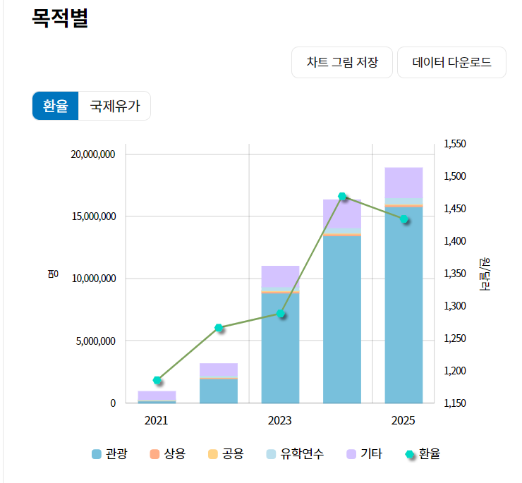
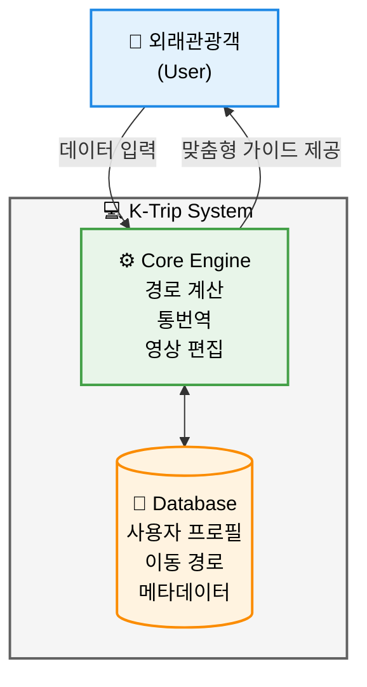

# 한국 여행 통합 가이드 프로그램 [K-Trip]
## - 1. Conceptualization -

  

**22311943 도영재**

  

**Yeungnam University**

---

# [ Revision history ]

| Revision date | Version # | Description | Author |
| :--- | :--- | :--- | :--- |
| 2026-03-20 | 1.0.0 | 초안 작성 | 도영재 |
| 2026-03-22 | 1.0.1 | 운영 개념 및 상세 기능 보완 | 도영재 |
| 2026-03-25 | 1.0.2 | 이미지 및 다이어그램 추가 | 도영재 |
| 2026-03-26 | 1.0.3 | 목차 순서 및 용어 정리 | 도영재 |

---

# [ Contents ]

1. **Business purpose** 
2. **System context diagram** 
3. **Use case list** 
4. **Concept of operation** 
5. **Problem statement** 
6. **Glossary** 
7. **References** 

---
# 1. Business Purpose (사업 목적)

## 1.1 Project Background (프로젝트 배경)

   
  <em>목적별 외래관광객 입국자 수 추이</em>

한국을 방문하는 **외래관광객**은 꾸준히 증가하고 있으나, 기존의 여행 앱들은 인터페이스가 복잡하거나 언어 장벽을 완전히 해소하지 못해 사용자가 '딱딱하다'고 느끼는 경우가 많습니다. **외래관광객**들이 한국의 복잡한 교통망이나 역내 시설을 더 직관적이고 친절하게 이용할 수 있는 서비스가 필요합니다. 특히 공항 도착 직후의 숙소 이동, 복잡한 역내 보관함 찾기 등 실질적인 이동 편의성에 대한 니즈가 매우 높습니다.

## 1.2 Goal (목표)
* **사용자 맞춤형 초기 설정**: 이름, 나이, 국적, 언어 정보를 바탕으로 앱 전체 언어를 자동 세팅하여 접근성을 높입니다.
* **스마트 이동 가이드**: 숙소 정보를 연동하여 택시비, 소요 시간 및 지하철 출입구 방향까지 포함한 상세 경로를 제공합니다.
* **AI 실시간 회화**: 상황별 한국어 출력 후, 상대방의 답변을 10초간 청취하여 사용자의 언어로 번역해 주는 양방향 소통을 지원합니다.
* **여행 기록의 영상화**: 이동 경로를 지도에 기록하고(GPS), 중간 지점마다 사진 깃발을 세워 이를 숏폼 영상으로 자동 제작합니다.
* **역내 라커 위치 안내**: 길을 잃기 쉬운 지하철 역사 내 보관함 위치를 직관적으로 표시하여 편의를 제공합니다.

---

# 2. System Context Diagram (시스템 구조)

# 3. Use Case List (주요 기능 목록)

| ID | 기능명 (Use Case) | 상세 설명 (Description) |
| :--- | :--- | :--- |
| 1 | **개인화 설정** | **외래관광객**이 국적 및 언어를 선택하면 앱 내 모든 텍스트를 해당 언어로 자동 변경합니다. |
| 2 | **이동 가이드** | 현재 위치에서 숙소까지의 택시비, 소요 시간, 대중교통 상세 동선을 제공합니다. |
| 3 | **실시간 회화** | 상황별 문구를 제공하고, 상대방의 답변을 실시간으로 청취하여 사용자의 언어로 번역합니다. |
| 4 | **나만의 지도** | 이동 동선을 지도에 표시하고, 촬영한 사진을 결합하여 짧은 여행 영상을 자동 제작합니다. |
| 5 | **라커 위치 찾기** | 지하철 역사 내 보관함의 정확한 위치를 시각적으로 안내하여 편의를 제공합니다. |
| 6 | **장소 검색** | 특정 관광지나 시설을 클릭하여 연관된 상세 정보 및 리뷰를 검색합니다. |
| 7 | **자동 정리** | 여행 중 기록된 위치 및 시간 데이터를 바탕으로 여행 일정을 날짜별로 자동 분류합니다. |

---

# 4. Concept of Operation (운영 개념)

본 시스템은 **외래관광객**이 한국에 도착한 순간부터 여행을 마치고 기록을 남기는 모든 과정을 유기적으로 연결하며, 다음과 같은 단계별 운영 흐름을 가집니다.

### 4.1 초기 개인화 및 환경 설정 (Personalized Onboarding)
* **언어 및 프로필 동기화**: 앱 실행 시 사용자의 국적, 이름, 성별, 선호 언어를 입력받습니다. 시스템은 이 정보를 즉시 반영하여 앱 내 모든 메뉴, 안내 음성, 경고 문구 등을 해당 언어로 자동 전환하여 사용자의 진입 장벽을 낮춥니다.
* **숙소 정보 사전 연동**: 여행의 베이스캠프가 될 숙소 주소나 예약 정보를 입력하면, 시스템은 이를 '홈(Home)'으로 지정합니다. 이후 사용자가 어디에 있든 클릭 한 번으로 숙소로 돌아가는 최적 경로를 우선적으로 제안받을 수 있도록 상시 대기 모드를 유지합니다.

### 4.2 상황 인지형 스마트 이동 가이드 (Context-Aware Navigation)
* **다중 교통수단 비교 안내**: 사용자의 현재 위치에서 목적지까지 택시 예상 요금, 지하철/버스의 실시간 도착 시간 및 혼잡도를 비교하여 제공합니다. 특히 한국 지하철의 특성을 반영하여 '빠른 환승 칸' 정보나 역내 하차 후 출구까지의 도보 동선을 상세히 안내합니다.
* **역내 상세 지점 시각화**: 복잡한 대형 역사 내에서 사용자가 길을 잃지 않도록 지하철 출입구 번호와 방향을 시각적(AR 화살표 또는 주요 랜드마크 사진)으로 안내하여 심리적 불안감을 해소합니다.

### 4.3 AI 기반 양방향 커뮤니케이션 (Interactive AI Interpretation)
* **상황별 필수 문구 제공**: 식당 주문, 물건 구매, 응급 상황 등 여행 중 마주할 수 있는 주요 시나리오별 한국어 문구를 제공합니다. 사용자가 문구를 선택하면 원어민에 가까운 발음으로 음성을 송출하여 의사소통을 돕습니다.
* **양방향 청취 및 실시간 번역**: 상대방(현지인)의 답변이 시작되면 시스템이 약 10~15초간 음성을 집중 청취합니다. 수집된 한국어 음성은 즉시 분석되어 사용자의 언어로 번역·표시되므로, 언어 장벽 없이 실시간 대화가 가능합니다.

### 4.4 여행 기록의 자동 영상화 (Automated Travel Logging)
* **GPS 경로 트래킹**: 사용자가 이동하는 동안 시스템은 백그라운드에서 이동 동선을 GPS 데이터로 기록합니다. 특정 관광지나 카페 등에서 일정 시간 머무를 경우 해당 지점을 자동으로 '여행 포인트'로 등록합니다.
* **숏폼 영상 자동 편집**: 여행 중 촬영한 사진과 동영상을 GPS 경로 데이터와 결합합니다. 지도 위에 이동 선이 그려지며 사진이 깃발처럼 나타나는 애니메이션 효과를 적용하여, 별도의 편집 없이도 SNS에 바로 공유 가능한 브이로그 영상을 자동 생성합니다.

### 4.5 위치 기반 편의시설 탐색 (Locker & Facility Finder)
* **실시간 보관함 가시화**: 무거운 짐을 소지한 **외래관광객**을 위해 주변 지하철 역사 내 물품 보관함(Locker)의 위치와 현황을 탐색합니다. 현재 위치에서 보관함까지 가는 최단 경로를 역사 내부 지도로 보여주어 사용자의 신체적 피로도를 최소화합니다.

---

# 5. Problem Statement (문제 정의)

시스템은 **외래관광객**의 위치 및 상황 정보를 정확히 파악하고 실시간으로 상호작용할 수 있어야 합니다. 다음은 시스템이 해결해야 할 주요 문제와 제공해야 할 편의성 명세입니다.

### 5.1 데이터 정보 파악 및 정확도
* **데이터 분석**: 실시간 위치(GPS), 교통 상황, 언어 번역 데이터 등 다양한 메타데이터를 신속하고 정확하게 인식해야 합니다. 
* **정확한 정보 매칭**: 사용자의 국적과 언어 설정에 맞는 최적화된 관광 정보와 길 안내 데이터를 오류 없이 매칭하는 것이 핵심입니다.

### 5.2 시스템 상호작용 및 반응성
* **실시간 처리**: 이동 가이드 및 통번역 기능은 사용자의 대기 시간을 최소화하기 위해 높은 실시간 반응성을 유지해야 합니다.
* **유동적 기준 적용**: 사용자의 현재 위치나 시간대 등 가변적인 상황에 맞춰 안내 우선순위를 동적으로 변경해야 합니다.

### 5.3 사용자 편의성 (GUI)
* **직관적 디자인**: **"Simple is best"** 원칙에 따라 복잡한 메뉴를 배제하고, 외국인 사용자도 별도의 학습 없이 바로 사용할 수 있는 간결한 인터페이스를 제공해야 합니다.

---

# 6. Glossary (용어 사전)

* **K-Trip**: 본 프로그램의 명칭으로, **외래관광객**을 위한 한국 여행 통합 가이드 시스템을 의미합니다.
* **유저 (User)**: 서비스를 이용하는 주체인 **외래관광객**을 뜻합니다.
* **Locker Finder**: 역내외 물품 보관함의 위치를 기반으로 실시간 경로를 안내하는 핵심 기능을 의미합니다.
* **GUI (Graphical User Interface)**: 사용자가 앱의 기능을 직관적으로 사용할 수 있도록 제공되는 시각적 조작 환경입니다.

---

# 7. References (참고 문헌)

본 프로젝트 기획을 위해 참고한 문헌 및 자료 리스트입니다.

* **통계 자료**: 한국관광공사(KTO) - 방한 외래관광객 입국자 수 및 관광 통계 (2024-2025)
* **학술 자료**: 영남대학교(Yeungnam University) 스마트 관광 콘텐츠 설계 가이드라인
* **기술 문서**: Google Maps Platform - Places API 및 Directions API 기술 문서
* **기타**: 국내 주요 지하철 역사(서울역, 홍대입구 등) 내 물품 보관함 배치도 및 운영 현황 자료

---
