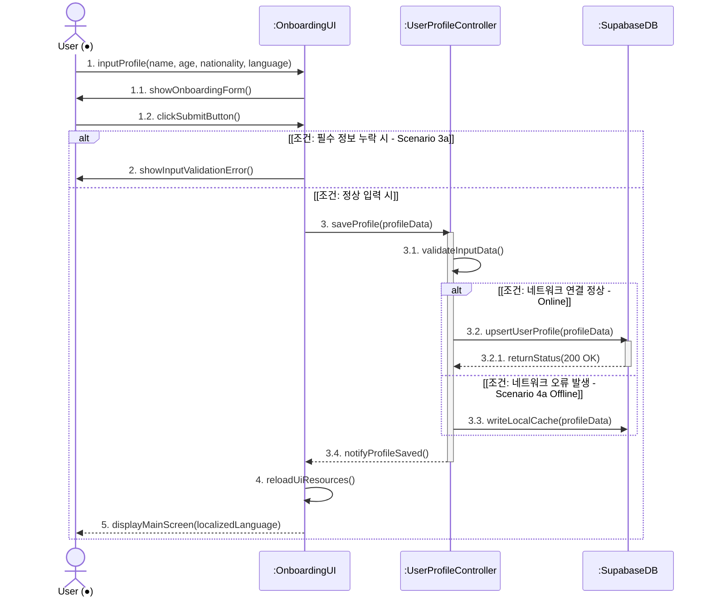
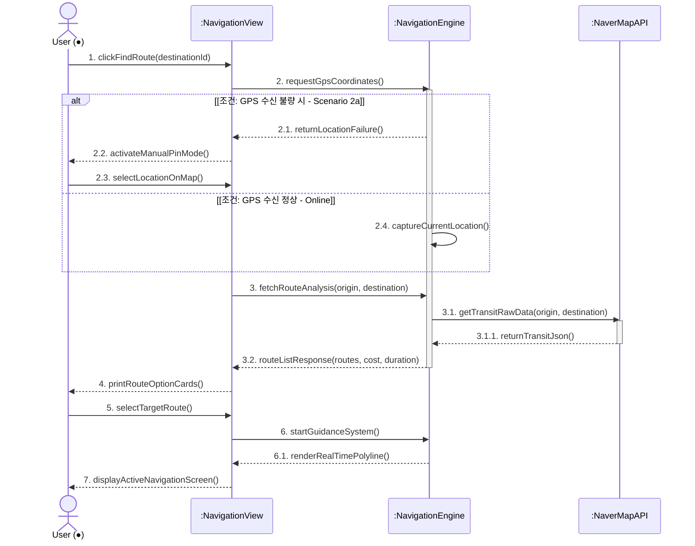
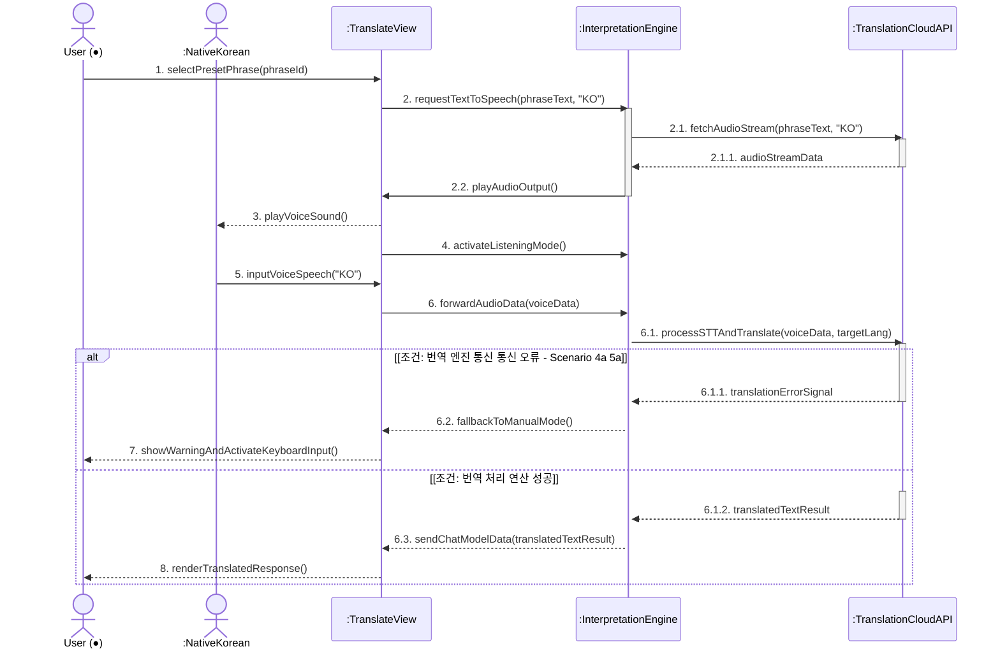
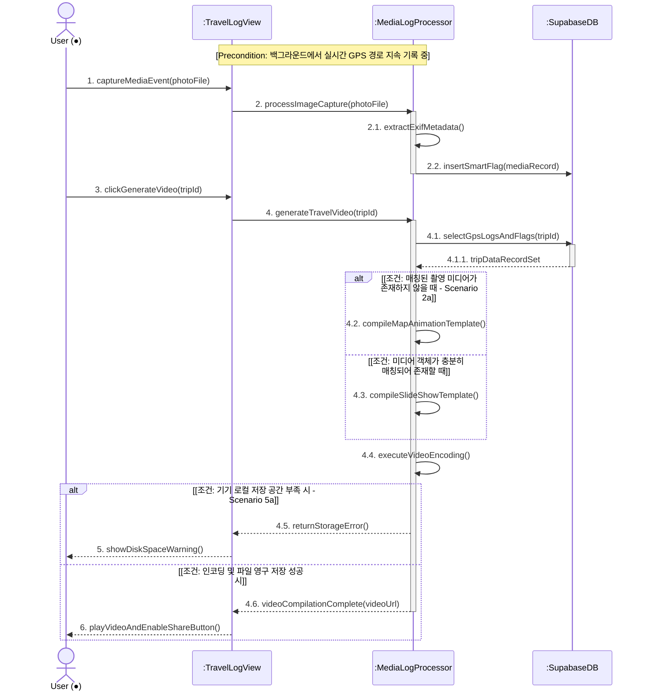
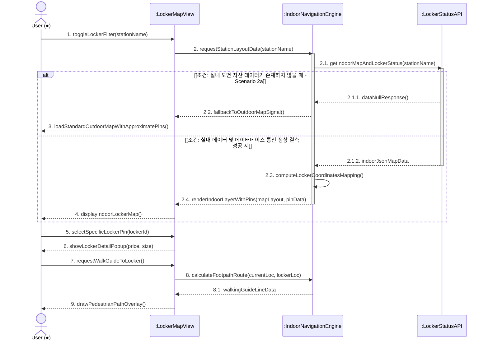
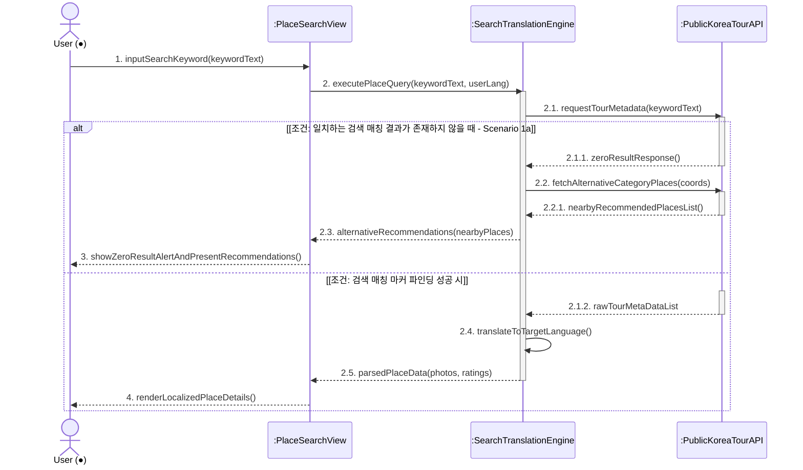
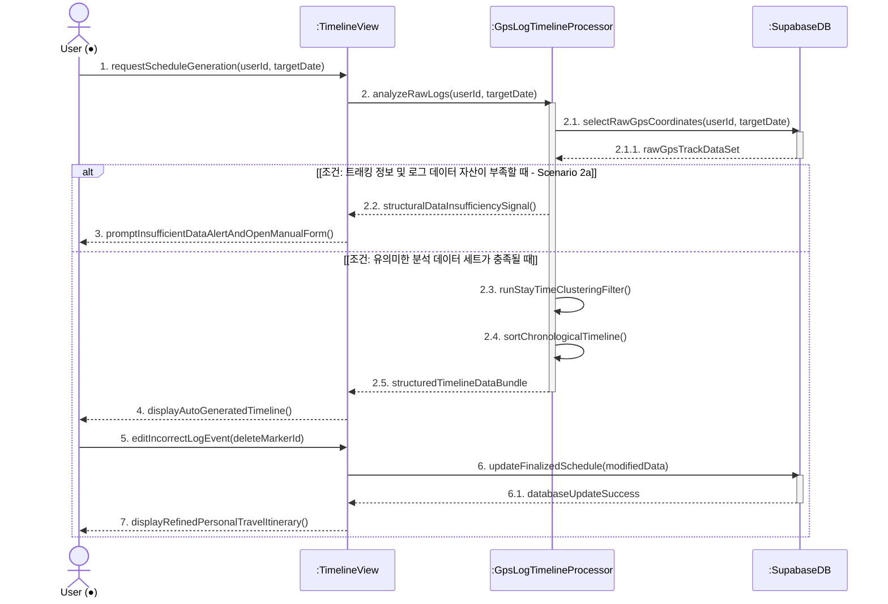
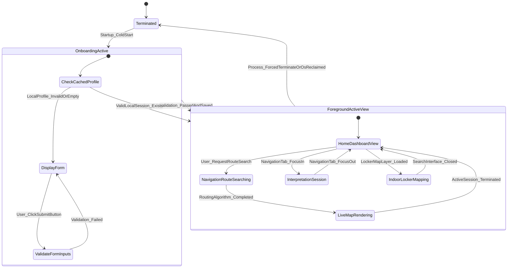
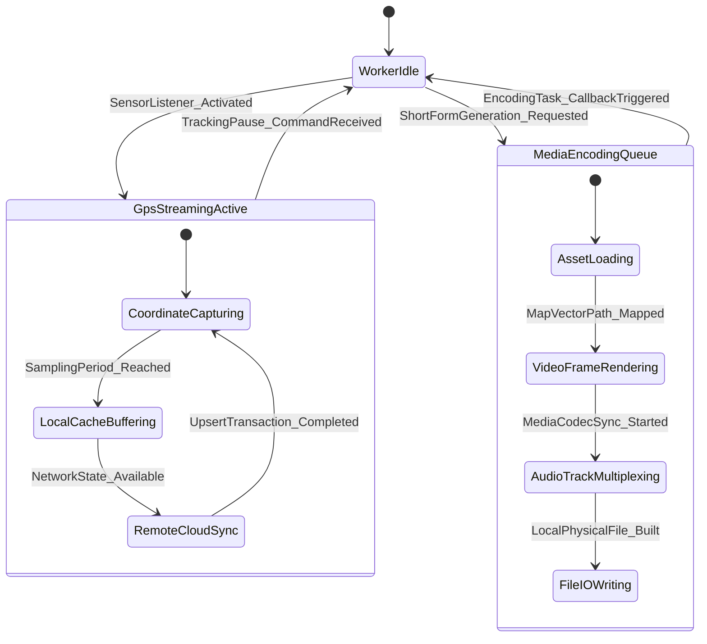

# 한국 여행 통합 가이드 프로그램 [K-Trip] - 시스템 디자인 설계서

  

**22311943 도영재**

  

**Yeungnam University**

---

# [ 개정 이력 (Revision History) ]

| 개정 일자 | 버전 | 개정 내용 상세 | 작성자 |
| :--- | :--- | :--- | :--- |
| 2026-06-04 | v1.0.0 | K-Trip 개념정의서 및 분석서 기반 아키텍처 및 시스템 설계서 초안 작성 | 도영재 |
| 2026-06-04 | v1.0.1 | 각 Use Case별 시퀀스 다이어그램 및 상태 머신 다이어그램 구현, 관련 설명 명세 기술  | 도영재 |
| 2026-06-05 | v1.0.2 | 영남대학교 가이드라인 반영 (VIEW 및 CORE 클래스 구조 구현 ) | 도영재 |

---

---

# [ 목차 (Contents) ]

1. **소개 (Introduction)**
   - 1.1. 시스템 개요 및 배경
   - 1.2. 아키텍처 설계의 핵심 주안점
2. **클래스 다이어그램 (Class Diagram)**
   - 2.1. VIEW 레이어 아키텍처 및 상세 명세 (프론트엔드 UI 컴포넌트)
   - 2.2. CORE 레이어 아키텍처 및 상세 명세 (백엔드 컨트롤러 및 인프라)
3. **시퀀스 다이어그램 (Sequence Diagram)**
   - 3.1. 개인화 설정 (Use Case #1)
   - 3.2. 스마트 이동 가이드 (Use Case #2)
   - 3.3. AI 실시간 회화 (Use Case #3)
   - 3.4. 나만의 지도 (Use Case #4)
   - 3.5. 주변 라커 검색 (Use Case #5)
   - 3.6. 장소 검색 (Use Case #6)
   - 3.7. 자동 정리 (Use Case #7)
4. **상태 머신 다이어그램 (State Machine Diagram)**
   - 4.1. 애플리케이션 라이프사이클 뷰 상태 전이 (Application Lifecycle State)
   - 4.2. 백그라운드 워커 스레드 풀 상태 전이 (Background Worker State)
5. **시스템 구현 요구사양 (Implementation Requirements)**
   - 5.1. 하드웨어 플랫폼 요구사양
   - 5.2. 소프트웨어 플랫폼 요구사양
6. **용어 사전 (Glossary)**
7. **참고 문헌 (References)**

---

# 1. 소개 (Introduction)

## 1.1. 시스템 개요 및 배경
본 문서는 한국을 방문하는 외래 관광객 대상의 통합 가이드 모바일 솔루션인 **K-Trip**의 상세 정적 구조 및 동적 메커니즘을 정의하는 시스템 디자인(Design) 설계서입니다. 앞서 수립된 개념정의서(Conceptualization)의 비즈니스 가치와 요구사항 분석서(Analysis)의 Use Case 경계를 구체화하여, 실제 컴파일 및 배포가 가능한 수준의 객체 지향 구조와 인터랙션 메커니즘을 명세합니다.

현재 외래 관광객들이 직면한 가장 큰 장벽인 **국내 전용 교통 네트워크 파싱의 복잡성**, **실내 및 지하 음영 구역에서의 GPS 신호 유실**, **기존 범용 번역기의 한계로 인한 현지 소통 단절**을 해결하기 위해, 본 시스템은 정밀 지도 결합 컴포넌트와 백그라운드 분산 연산 스레드 아키텍처를 적극 도입합니다. 본 설계서는 Flutter 크로스플랫폼 프레임워크 기반의 유연한 UI 인터페이스 아키텍처와 Supabase 인프라를 유기적으로 동기화하여, 저사양 단말기에서도 끊김 없고(Seamless) 강건한 가이드 솔루션을 보장하도록 엔지니어링되었습니다.

## 1.2. 아키텍처 설계의 핵심 주안점
교수님 및 영남대학교 소프트웨어공학 연구실의 아키텍처 설계 지침을 철저히 준수하여, 본 시스템은 다음과 같은 3가지 핵심 공학적 설계 주안점을 바탕으로 구성되었습니다.

* **VIEW와 CORE 비즈니스 로직의 엄격한 분리**:
  모바일 기기의 디스플레이 렌더링을 전담하는 프론트엔드 UI 컴포넌트 레이어(`View`)와 비즈니스 도메인 지식, 데이터 변환, 알고리즘 연산을 처리하는 컨트롤러 및 영속성 레이어(`Core`)를 구조적으로 완전히 격리합니다. 이로써 단일 책임 원칙(SRP)을 달성하고, 무거운 백엔드 연산 중에 프런트 스레드가 블로킹되어 발생하는 UI 버벅임(Jank) 현상을 근본적으로 차단하며, 코드의 단위 테스트(Unit Test) 용이성을 확보합니다.

* **비동기 백그라운드 워커 및 멀티스레드 배치 아키텍처**:
  실시간 GPS 위치 스트리밍 수집, 대화 청취용 오디오 주파수 연속 버퍼링, 하드웨어 자원을 극도로 소모하는 FFmpeg 기반의 여행 동선 숏폼 동영상 미디어 인코딩 등의 중량급 연산을 담당하는 독립적인 백그라운드 워커 풀(Worker Pool)을 레이어 수준에서 정의합니다. UI 스레드와 병렬로 집행되는 컨커런트(Concurrent) 아키텍처를 구현하여 디바이스의 하드웨어 수명을 최적화하고 사용자 경험을 손상하지 않도록 제어합니다.

* **분산 환경에서의 데이터 무결성 및 고신뢰성 복원 매커니즘**:
  지하 역사, 대형 쇼핑몰, 터널 등 통신 음영 구역이 빈번한 국내 도심 환경을 고려하여, 원격 서버인 `SupabaseDB`의 클라우드 영속성 테이블과 단말 내부의 `Local Cache Storage` 간의 지능형 업서트(Upsert) 및 폴백(Fallback) 동기화 파이프라인을 구축합니다. 이를 통해 네트워크가 완전히 차단된 상황에서도 사용자는 오프라인 맵 가이드와 로컬 미디어 지오태깅 로그 기록을 영속적으로 영위할 수 있으며, 연결 회복 시 트랜잭션 충돌 없이 원격 서버에 상태를 즉시 동기화하여 데이터 무결성(Data Integrity)을 100% 만족시킵니다.

---
## 3.1. Personalized Onboarding (개인화 설정 - Use Case #1)

개요 (Summary): 앱 최초 가동 시 외래 관광객의 기본 프로필 정보를 입력받아 데이터 유효성을 검증하고, 네트워크 상태에 따라 원격 Supabase DB 또는 로컬 캐시에 바인딩하여 다국어 UI 자원을 리로드하는 흐름.

선행 조건 (Preconditions): 앱이 최초 실행되었거나 사용자가 프로필 수정 메뉴에 진입한 상태여야 함.

기본 흐름 (Basic Flow):

사용자가 이름, 나이, 국적, 선호 언어를 입력하고 제출 버튼을 클릭함.

UserProfileController가 입력 데이터의 누락 여부 및 유효성을 검증함.

네트워크가 연결된 정상 상태일 경우, 원격 SupabaseDB에 유저 프로필 정보를 업서트(upsertUserProfile)함.

저장 완료 응답을 수신하면 UI 레이어에 완료 이벤트를 통지함.

UI 레이어에서 선택된 언어에 맞는 리소스를 리로드하고 맞춤형 메인 대시보드를 화면에 표출함.

대안 및 예외 흐름 (Alternative / Exception Flows):

[Scenario 3a: 필수 정보 누락] 유효성 검증 단계에서 데이터 공백이 감지될 경우, UI 레이어로 에러 신호를 반환하여 경고 메시지를 출력하고 재입력을 유도함.

[Scenario 4a: 네트워크 오류 발생] 원격 DB 통신이 불가능한 오프라인 상태일 경우, 기기 내부 로컬 캐시 저장을 우선 집행(writeLocalCache)한 뒤 추후 동기화 알림을 처리함.

## 3.2. Smart Navigation Guide (스마트 이동 가이드 - Use Case #2)
현재 하드웨어 GPS 위치 좌표를 기준으로 탐색된 대중교통 노선망과 택시 비용 추정 메트릭이 전방 스크린에 시각화되는 연동 메커니즘입니다.

개요 (Summary): 유저의 목적지 검색 요청에 따라 하드웨어 GPS 좌표를 확보하고, 외부 Naver Map API와 연동하여 도보, 대중교통, 택시별 비용 및 시간 메트릭을 분석하여 실시간 폴라인 가이드라인을 렌더링하는 흐름.

선행 조건 (Preconditions): 모바일 기기의 위치 권한이 승인되어 있어야 하며, 목적지 데이터가 유효해야 함.

기본 흐름 (Basic Flow):

사용자가 목적지를 검색하거나 홈 화면의 'Go Home' 단축 버튼을 클릭함.

NavigationEngine이 디바이스의 하드웨어 센서를 깨워 현재 위치의 GPS 좌표 수신을 시도함.

정상적으로 좌표가 획득되면 출발지와 목적지 좌표를 기반으로 외부 NaverMapAPI에 실시간 교통 데이터 파싱을 요청함.

분석된 대중교통 경로 정보 데이터 셋을 JSON 형태로 반환받아 최적의 이동 옵션 카드를 화면에 리스트업함.

사용자가 특정 경로를 선택하면 실시간 보행 가이드라인 엔진이 가동되어 전방 화면 위에 내비게이션 오버레이를 표출함.

대안 및 예외 흐름 (Alternative / Exception Flows):

[Scenario 2a: GPS 수신 불량] 터널, 지하 역사 등 음영 구역으로 인해 GPS 좌표 획득에 실패할 경우, 위치 확인 실패 이벤트를 반환하고 사용자가 지도 레이어 위에서 직접 핀을 지정할 수 있는 수동 위치 설정 모드를 활성화함.

## 3.3. AI Real-time Interpretation (AI 실시간 회화 - Use Case #3)
관광객과 한국인 현지 소통 대상 간의 대화 오디오 스트림을 백그라운드 집중 청취 스레드로 전송하여 양방향 실시간 STT 및 인공지능 번역 결과물을 출력하는 컴포넌트 상호작용입니다.

개요 (Summary): 외래 관광객과 현지 한국인 간의 양방향 소통을 지원하기 위해, 상황별 프리셋 TTS 음성 재생과 실시간 백그라운드 오디오 오케스트레이션을 통한 STT 및 번역 처리를 수행하는 흐름.

선행 조건 (Preconditions): 모바일 내장 마이크 및 오디오 출력 장치가 정상 작동 중이어야 하며, 클라우드 AI 번역 API 가동 상태가 양호해야 함.

기본 흐름 (Basic Flow):

관광객이 상황별 카테고리 폼에서 특정 한국어 안내 프리셋 문구를 선택함.

InterpretationEngine이 원격 번역 클라우드 API를 호출하여 해당 텍스트를 아날로그 오디오 스트림(TTS)으로 변환함.

반환된 오디오 스트림을 재생하여 현지 한국인에게 음성을 출력함.

UI 내부적으로 답변 청취 스레드 모드를 자동 활성화하여 대기 상태로 전환함.

한국인의 음성 답변이 마이크로 수신되면 원격 API를 통해 음성 인식(STT) 및 타겟 언어 번역 가공 연산을 일괄 수행함.

가공 완료된 최종 텍스트 데이터를 채팅 UI 레이아웃 형태로 화면에 렌더링함.

대안 및 예외 흐름 (Alternative / Exception Flows):

[Scenario 4a / 5a: 번역 엔진 및 인공지능 통신 오류] 클라우드 API 패킷 전송 중 타임아웃이나 파싱 에러가 발생할 경우, 엔진 폴백 매커니즘을 가동하여 예외 메시지를 전송하고, 키보드로 직접 타이핑하여 번역하는 텍스트 입력 수동 전환 모드를 제안함.

## 3.4. Automated Travel Logging & Video Encoding (나만의 지도 - Use Case #4)
동선 경로에 누적된 지오태깅 미디어 객체들을 백그라운드 멀티스레드 비디오 인코더 풀로 인입하여 가상 지도 이동 애니메이션 효과와 함께 컴파일 및 영구 아카이빙하는 과정입니다.

개요 (Summary): 백그라운드에서 실시간 트래킹 중인 GPS 위경도 경로 더미 위에, 유저가 관광지에서 촬영한 미디어 객체의 EXIF 메타데이터를 조인(Join)하여 스마트 플래그화하고 동영상으로 인코딩 및 아카이빙하는 흐름.

선행 조건 (Preconditions): 백그라운드 GPS 로그 수집 트래커 풀이 활성화되어 로그가 누적되고 있어야 함.

기본 흐름 (Basic Flow):

사용자가 앱 카메라를 이용해 사진 또는 영상을 촬영함.

MediaLogProcessor가 미디어 파일 내부에 포함된 EXIF 메타데이터(시간, 좌표)를 추출함.

추출된 메타데이터를 동일 시간대 백그라운드 GPS 동선과 매칭하여 원격 SupabaseDB에 랜드마크 포인트(Smart Flag)로 영구 적재함.

사용자가 특정 일정에 대한 '영상 생성' 트래킹 결과물을 요청함.

데이터베이스에서 해당 일정의 모든 경로 좌표와 매칭 미디어를 일괄 쿼리(Query)함.

미디어 슬라이드쇼 템플릿과 벡터 지도 이동 애니메이션 코덱을 결합하여 가상 인코딩 파이프라인을 집행함.

컴파일이 성공하면 로컬 물리 디렉터리에 .mp4 저장을 완료하고 미리보기 및 공유 인터페이스를 제공함.

대안 및 예외 흐름 (Alternative / Exception Flows):

[Scenario 2a: 매칭 미디어 자산 전무] 해당 일정 중 유저가 촬영한 사진 객체가 없을 경우, 프로세서 내부 가이드를 변경하여 순수 지도 트래킹 벡터 애니메이션 위주의 모션 그래픽 템플릿을 선택하여 컴파일함.

[Scenario 5a: 로컬 저장 공간 부족] 기기의 가용 디렉터리 물리 용량이 파일 크기보다 작을 경우, 디스크 스페이스 에러를 반환하고 UI 단에 미디어 정리 가이드 안내 팝업을 출력함.

## 3.5. Locker & Facility Finder (주변 라커 검색 - Use Case #5)
지하 역사 및 쇼핑몰 등 위성 GPS 신호가 음영되는 복잡 계층 구조 속에서 로컬 구조 기하 데이터를 기반으로 시설물의 정확한 위치를 다중 레이어 화면으로 하이라이트하는 흐름입니다.

개요 (Summary): GPS 신호 도달이 불가능한 대형 지하 역사 또는 쇼핑몰 공간에서, 로컬 DB 내 실내 기하 레이아웃 도면과 실시간 보관함 API 상태를 매핑하여 다중 계층 보행 가이드 라인을 중첩 표출하는 흐름.

선행 조건 (Preconditions): 타겟 대상 지하역 명칭 검색 데이터 또는 인근 인클로저 범위 필터링이 유효해야 함.

기본 흐름 (Basic Flow):

사용자가 특정 역 이름을 검색하거나 화면 내 'Locker' 필터 요소를 클릭함.

IndoorNavigationEngine이 해당 역사 식별자를 파라미터로 넘겨 실내 도면 자산 데이터 및 라커 잔여 상태 API 호출을 집행함.

반환받은 로컬 기하 Json 정보를 파싱하여 내부 맵 레이아웃 위에 보관함 위치를 위경도 좌표 기준 핀 객체로 정확히 매핑 연산함.

UI 화면 레이어 위에 정밀 실내 맵과 실시간 보관 가능 여부 아이콘 핀을 오버레이 드로잉함.

사용자가 특정 핀을 클릭하면 요금 및 크기 상세 제원 팝업을 띄우고, 현 위치로부터 핀까지의 실내 보행 전용 최적 경로(Footpath Polylines)를 계산하여 레이어 화면에 하이라이트함.

대안 및 예외 흐름 (Alternative / Exception Flows):

[Scenario 2a: 역사 실내 도면 데이터 부재] 공공 데이터베이스 혹은 자체 서버 내에 해당 지역의 정밀 실내 레이아웃 정보가 결측되어 있을 경우, 데이터 전무 응답을 처리하여 일반 외부 개방형 표준 지도로 맵 뷰를 신속히 전환(Fallback)하고 대략적인 위치 마커만 가이드함.

## 3.6. Plach Search (장소 검색 - Use Case #5)

개요 (Summary): 다국어 키워드 검색 또는 맵 마커 트리거를 통해 한국관광공사 Public TourAPI 및 Supabase 데이터를 조회하여 콘텐츠를 사용자가 설정한 선호 언어로 번역 가공 및 동적 렌더링하는 흐름.

선행 조건 (Preconditions): 설정된 사용자 선호 국적/언어 메트릭 정보가 프로필 컨텍스트 내에 존재해야 함.

기본 흐름 (Basic Flow):

사용자가 검색창에 텍스트 키워드를 입력하거나 지도 인근 마커를 탭함.

SearchTranslationEngine이 키워드와 선호 언어 코드를 인입받아 원격 PublicKoreaTourAPI 인스턴스로 관광지 메타데이터 쿼리를 요청함.

API 서버로부터 장소 원천 레코드(사진, 리뷰 데이터 셋)를 바인딩하여 수신함.

데이터 구조를 유저 언어 설정에 맞춰 번역 모듈을 가동하여 상세 레이아웃 페이지를 백그라운드 빌드함.

가공이 완료된 다국어 평점, 사진, 현지 리뷰 화면을 가독성 있게 표출함.

대안 및 예외 흐름 (Alternative / Exception Flows):

[Scenario 1a: 일치하는 검색 결과 전무] 오타 또는 외래어 표기 방식 차이로 인해 키워드 쿼리 매칭 카운트가 0건일 경우, 현재 유저의 중심 위경도 좌표를 추출하여 카테고리 기반 인근 유사 명소 리스트업 데이터(Alternative Recommendations)를 재요청해 대안 추천 화면을 드로잉함.

## 3.7 Auto Schedule Organizer (자동 정리 - Use Case #7)

개요 (Summary): 하루 일정이 종료되는 시점에 축적된 GPS 원시 로그 좌표 더미(Raw Log Dataset)를 분석하고 밀집도 및 체류 시간 분할 클러스터링 알고리즘을 수행하여 타임라인 형태로 가공 및 수동 보정을 지원하는 흐름.

선행 조건 (Preconditions): 타겟팅된 특정 날짜의 디바이스 백그라운드 위치 데이터가 DB 테이블 내에 임계치 이상 쌓여 있어야 함.

기본 흐름 (Basic Flow):

사용자가 타임라인 메인 뷰 진입 혹은 여행 종료 트리거를 작동 시켜 '여행 일정 정리하기' 명령을 호출함.

GpsLogTimelineProcessor가 원격 SupabaseDB로부터 당일 적재된 위경도 Raw 시퀀스 좌표 데이터를 호출 및 로드함.

로드된 공간 포인트 시퀀스를 분석하여 특정 반경 내 15분 이상 머무른 중심 구역들을 식별하고 단순 이동 경로 노이즈를 필터링하는 체류 시간 분할 클러스터링 알고리즘을 가동함.

정제 완료된 방문 장소 데이터 셋을 시간 순서대로 구조화하여 시계열 타임라인 카드 세트로 구성해 표출함.

사용자가 잘못 검출된 노이즈 방문지를 수동으로 삭제하거나 메모를 추가(수동 보정 연산)하면 DB 테이블 레코드를 최종 업데이트 처리함.

대안 및 예외 흐름 (Alternative / Exception Flows):

[Scenario 2a: 수집된 로그 데이터 자산 부족] 기기 배터리 절전 모드나 센서 차단으로 인해 당일 저장된 좌표 시퀀스가 가공 임계치 미만일 경우, 정리 불가 이벤트를 반환하고 수동으로 장소를 직접 기입할 수 있는 수동 일정 폼(Manual Form Interface)으로 강제 유도함.

# 4. State Machine Diagram

## 4.1. Application Lifecycle State
K-Trip 모바일 클라이언트 프로그램의 기본 포그라운드 사용자 인터랙션 영역 상태 변화 흐름입니다.

개요 (Summary): K-Trip 모바일 클라이언트가 구동되어 프로세스가 적재되는 시점부터 사용자 온보딩 프로필 검증, 포그라운드 메인 대시보드 내에서의 주요 뷰(View) 상태 변화 및 프로세스 종료까지의 전체 라이프사이클을 기술한 다이어그램.

초기 상태 및 시작 전이 (Initial State & Startup): 시스템이 종료 상태(Terminated)에서 최초 기동(Startup_ColdStart) 이벤트를 만나 캡슐화된 하위 상태인 OnboardingActive 레이어로 진입함.

하위 상태별 세부 동적 흐름 (Substate Behaviors):

OnboardingActive (초기 설정 상태): 진입 시 로컬 캐시 프로필 존재 여부를 우선 확인(CheckCachedProfile)함. 캐시가 비어있으면 폼 화면을 띄우고(DisplayForm), 유저가 제출 버튼을 누르면 입력값 검증 상태(ValidateFormInputs)로 전이됨. 검증 실패 시(Validation_Failed) 다시 입력 폼으로 되돌아감.

ForegroundActiveView (메인 가동 상태): 프로필 검증을 정상 통과하거나 유효한 기존 세션이 존재하면 메인 대시보드(HomeDashboardView) 상태로 진입함. 홈 상태를 중심으로 사용자의 탭 포커스 및 요청에 따라 경로 탐색(NavigationRouteSearching), 실시간 맵 렌더링(LiveMapRendering), AI 회화 세션(InterpretationSession), 실내 라커 매핑(IndoorLockerMapping) 상태 간을 상호 전이함.

종료 및 예외 전이 (Termination Flow): 사용자가 앱을 명시적으로 종료하거나 OS에 의해 가용 메모리 자원이 회수될 경우(Process_ForcedTerminateOrOsReclaimed) 포그라운드 가동 상태에서 즉시 Terminated 상태로 전이되어 생명주기가 종료됨.

## 4.2. Background Worker State
UI의 블로킹을 막기 위해 커널 레벨에서 병렬 연산 및 외부 스트리밍 수신을 집행하는 백그라운드 스레드 엔진의 상태 다이어그램입니다.

개요 (Summary): K-Trip 모바일 클라이언트가 구동되어 프로세스가 적재되는 시점부터 사용자 온보딩 프로필 검증, 포그라운드 메인 대시보드 내에서의 주요 뷰(View) 상태 변화 및 프로세스 종료까지의 전체 라이프사이클을 기술한 다이어그램.

초기 상태 및 시작 전이 (Initial State & Startup): 시스템이 종료 상태(Terminated)에서 최초 기동(Startup_ColdStart) 이벤트를 만나 캡슐화된 하위 상태인 OnboardingActive 레이어로 진입함.

하위 상태별 세부 동적 흐름 (Substate Behaviors):

OnboardingActive (초기 설정 상태): 진입 시 로컬 캐시 프로필 존재 여부를 우선 확인(CheckCachedProfile)함. 캐시가 비어있으면 폼 화면을 띄우고(DisplayForm), 유저가 제출 버튼을 누르면 입력값 검증 상태(ValidateFormInputs)로 전이됨. 검증 실패 시(Validation_Failed) 다시 입력 폼으로 되돌아감.

ForegroundActiveView (메인 가동 상태): 프로필 검증을 정상 통과하거나 유효한 기존 세션이 존재하면 메인 대시보드(HomeDashboardView) 상태로 진입함. 홈 상태를 중심으로 사용자의 탭 포커스 및 요청에 따라 경로 탐색(NavigationRouteSearching), 실시간 맵 렌더링(LiveMapRendering), AI 회화 세션(InterpretationSession), 실내 라커 매핑(IndoorLockerMapping) 상태 간을 상호 전이함.

종료 및 예외 전이 (Termination Flow): 사용자가 앱을 명시적으로 종료하거나 OS에 의해 가용 메모리 자원이 회수될 경우(Process_ForcedTerminateOrOsReclaimed) 포그라운드 가동 상태에서 즉시 Terminated 상태로 전이되어 생명주기가 종료됨.

---

# 5. Implementation Requirements

## 5.1. Hardware Platform Requirements
* **Target Mobile Smartphone Devices**: 글로벌 규격 표준 GPS 및 블루투스/Wi-Fi 모듈이 실장된 외래객 소지 범용 스마트폰 기기군.
* **Application Processor (AP)**: ARMv8-A 고성능 64비트 아키텍처 기반의 옥타코어(Octa-Core) 프로세서 이상 스펙 (Qualcomm Snapdragon 7 계열 / Samsung Exynos 9800 계열 / Apple A12 Bionic 코어 프로세서 이상 최소 사양 필수).
* **System RAM**: 최소 4GB 가용 시스템 메모리 레이어 (다중 계층 벡터형 역사 실내 지도 드로잉 및 다량의 사진 객체 버퍼 처리를 고려하여 안정적 가동을 위한 **6GB RAM 사양 강력 권장**).
* **Internal Storage Space**: 애플리케이션바이너리 및 자원 데이터 설치 용량 150MB 외에, 전국 지하철 역사 정밀 도면 정보 및 동선 기반 생성 비디오 파일 영구 아카이빙 캐시 공간 확보를 위해 **최소 2GB 이상의 빈 공간 가용성 필수 요구**.
* **Essential Peripheral Sensor Modules**: 위치 확인 센서 모듈(A-GPS, GLONASS 지원 표준 칩셋), 물리 자이로스코프(Gyroscope) 및 지자기 방향 센서(내부 지향 헤딩 벡터 추적용), 고음질 오디오 스트림 수집 내장 마이크 및 통화 스피커 회로.

## 5.2. Software Platform Requirements
* **Target Operating System Spec**: Google Android 10.0 (API Level 29) 최저 지원 사양 이상 / Apple iOS 14.0 규격 소프트웨어 플랫폼 이상 버전 필수 타겟팅.
* **Development Toolkit & Engine Framework**: Flutter SDK 3.x 오픈소스 크로스플랫폼 프레임워크 상위 버전 및 Dart 3.x 강타입 모던 엔지니어링 언어 규격 컴파일 사양 준수.
* **Cloud Architecture & Backend Infrastructure**: Supabase Cloud Enterprise Tier 인스턴스 (Postgres 데이터베이스 엔진 기반, Real-time 웹소켓 채널 스트리밍 모듈, 원격 미디어 저장을 위한 Supabase Storage 서비스 연동).
* **Third-Party Open API & Client-Side Local SDK Matrix**: 
  * 공공데이터포털 연동 모듈 (한국관광공사 국문/다국어 TourAPI 4.0 전용 데이터 커넥터 포트 구현)
  * 대한민국 도심지 상세 표현용 Naver Map Mobile SDK Native 플러그인 랩퍼 인터페이스
  * 글로벌 호환 로컬라이징 및 폴라인 처리를 위한 Google Maps Platform SDK 커널 연동 모듈

---

# 6. Glossary

* **Onboarding (온보딩)**: 신규 진입 사용자가 어플리케이션 시스템에 도달했을 때 초기 이탈을 방지하고 최적의 경험을 향유하도록 선호 언어 및 개인 프로필 폼을 셋업하는 초기화 라이프사이클 단계.
* **Data Integrity (데이터 무결성)**: 데이터가 전송, 수정, 영구 적재되는 전체 생명주기 과정 속에서 인위적 변형, 누락, 데이터 유실이 발생하지 않고 원본 정보의 일관성과 정확성을 100% 보장하는 고신뢰성 특성.
* **STT (Speech-to-Text)**: 기기 오디오 마이크 캡처 회로로부터 수집된 인간의 아날로그 음성 주파수 원천 소스를 디지털 파동 해석 및 인공지능 딥러닝 디코딩 파이프라인을 거쳐 일반 텍스트 문자열 데이터로 변환해 주는 기술.
* **Polyline (폴라인)**: 모바일 지도 그래픽 인터페이스 화면 공간 위에 이동 경로를 정밀 가이드하기 위해 수많은 위도 및 경도 기하 벡터 좌표(LatLng)들을 순차 정렬 연결하여 연속 선형 레이어로 드로잉하는 다각선 아키텍처 모델.
* **Upsert (업서트)**: 데이터베이스 인스턴스 테이블에 레코드를 적재할 때, 유니크 제약 조건(Primary Key)에 걸리는 타겟 식별자가 존재하지 않으면 '신규 삽입(Insert)'을 집행하고, 이미 동일 키가 존재하면 '최신값 수정(Update)'으로 자동 병합 처리하는 지능형 데이터베이스 언어 트랜잭션 기법.

---

# 7. References

* **도영재 (2026)**, *한국 여행 통합 가이드 프로그램 [K-Trip] - Conceptualization Document*.
* **도영재 (2026)**, *한국 여행 통합 가이드 프로그램 [K-Trip] - Analysis Document*.
* **Object Management Group (OMG)**, *Unified Modeling Language (UML) Specification Version 2.5.1*, 정적 클래스 구조 및 동적 상호작용 표기 표준 가이드라인 가이드.
* **Supabase Open Source Community (2025)**, *PostgreSQL Real-time Syncer & Mobile Database Client Architecture Documentation*, 원격 동기화 설계 지침 참조.
