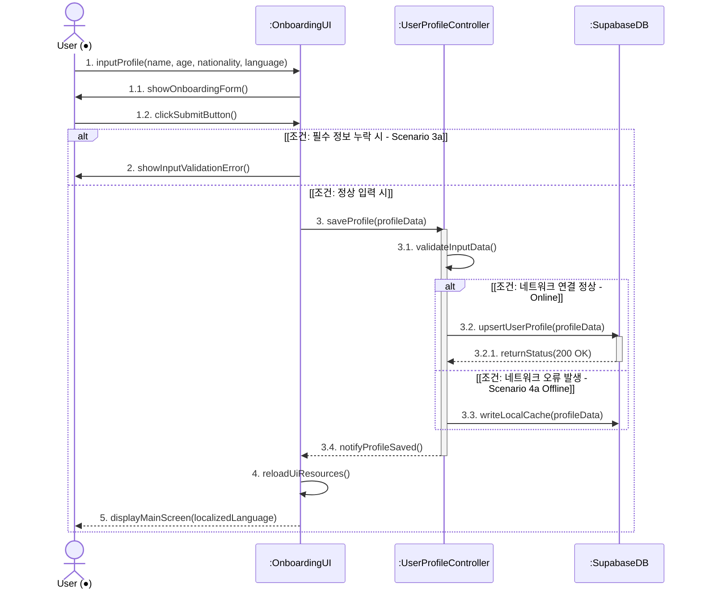
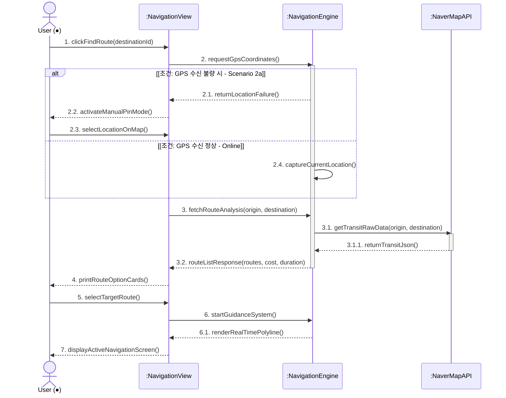
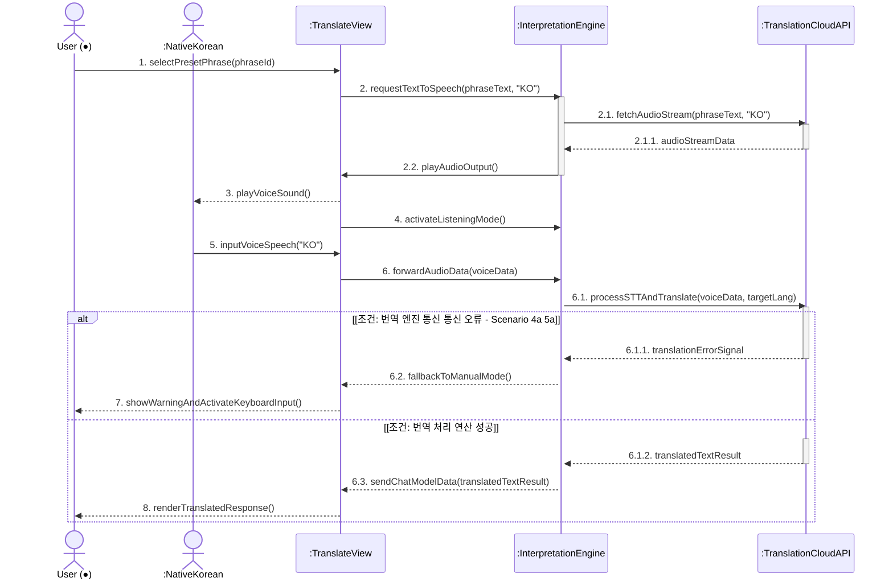
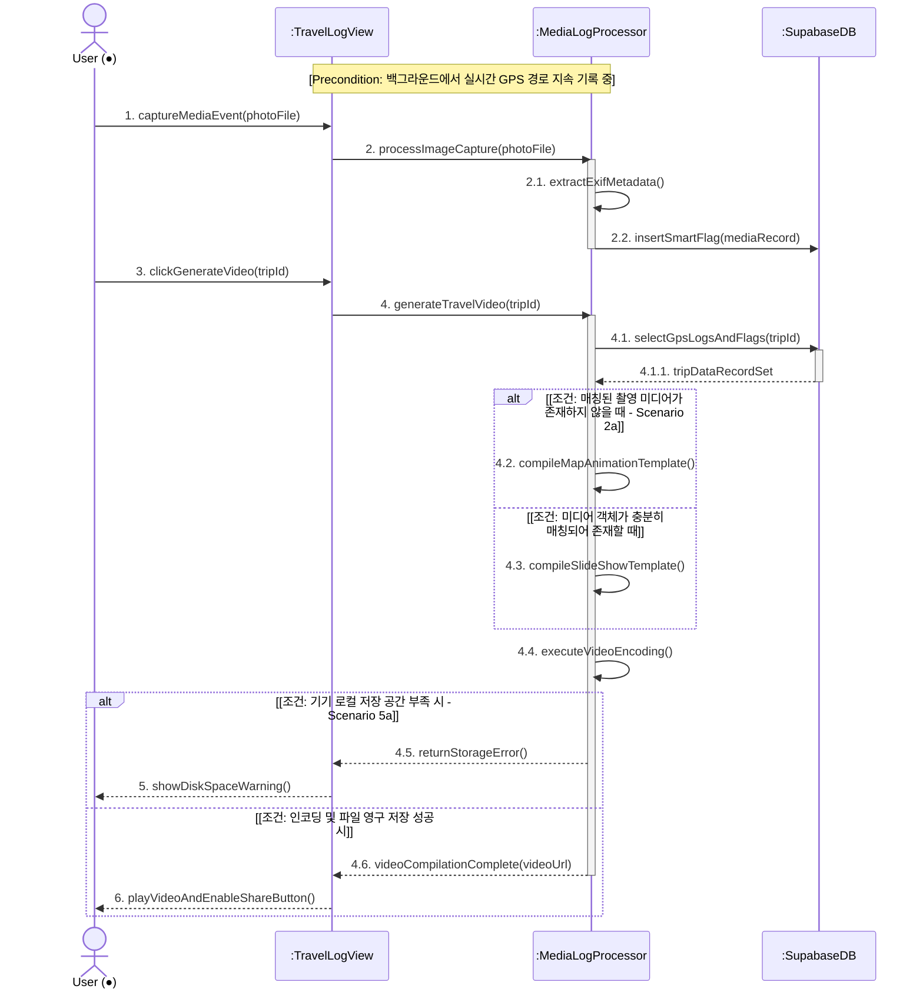
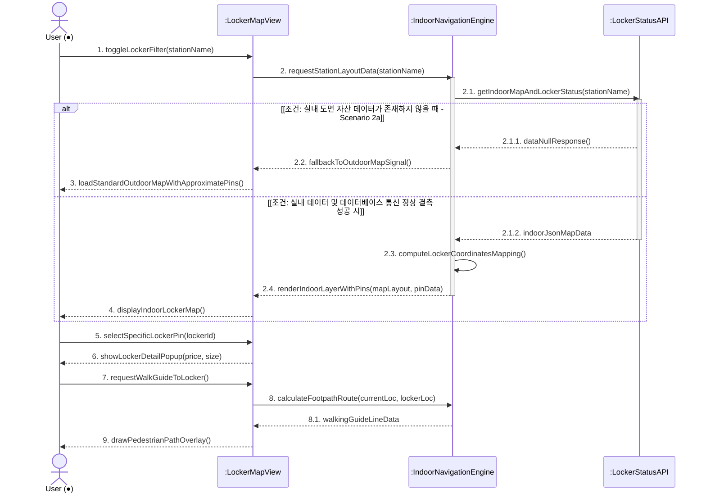
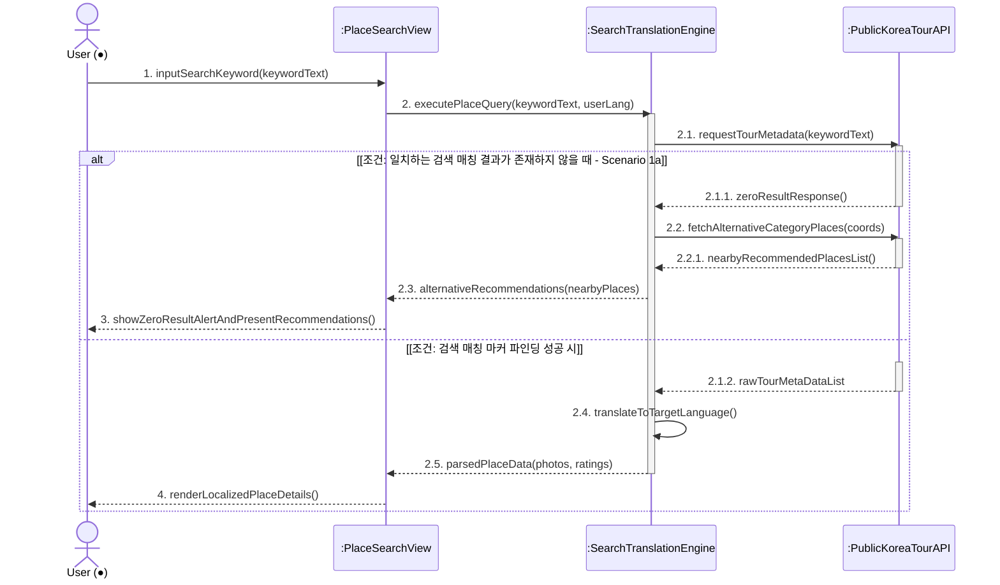
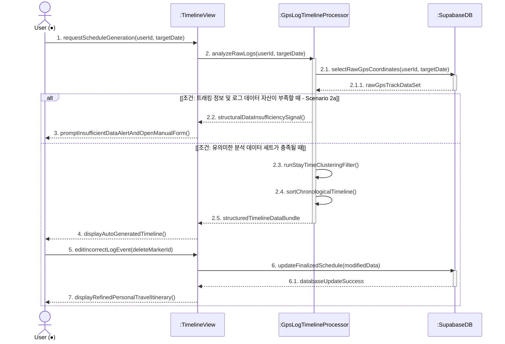
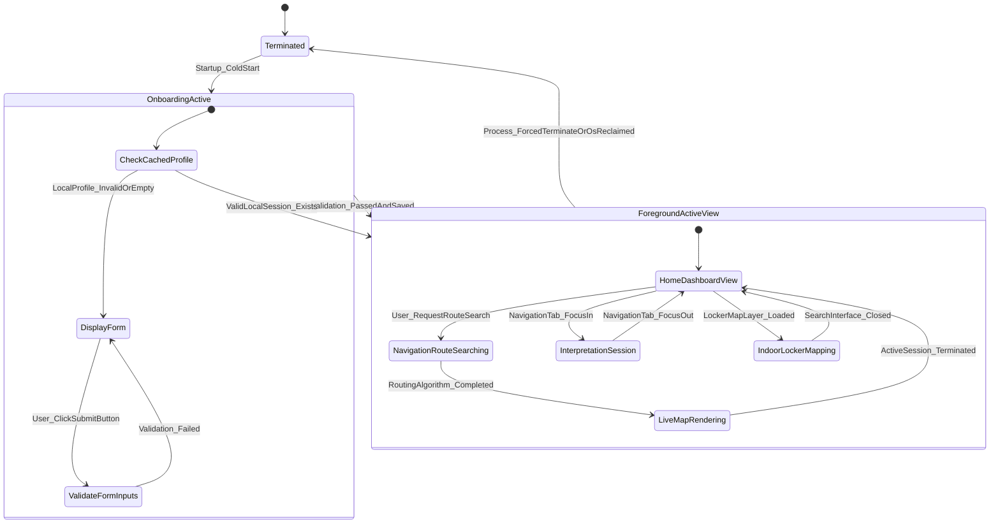
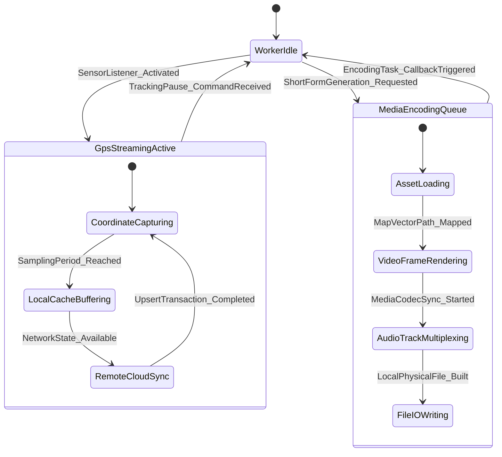

# 한국 여행 통합 가이드 프로그램 [K-Trip] - 시스템 디자인 설계서

  

** 22311943 도영재**

  

** (Yeungnam University)**

---

# [ 개정 이력 (Revision History) ]

| 개정 일자 | 버전 | 개정 내용 상세 | 작성자 |
| :--- | :--- | :--- | :--- |
| 2026-06-04 | v1.0.0 | K-Trip 개념정의서 및 분석서 기반 아키텍처 및 시스템 설계서 초안 작성 | 도영재 |
| 2026-06-04 | v1.0.1 | 영남대학교 가이드라인 반영 (VIEW 및 CORE 클래스 구조 전면 분리 및 HTML 스펙 테이블화) | 도영재 |

---

# [ 목차 (Contents) ]

1. **소개 (Introduction)**
   - 1.1. 시스템 개요
   - 1.2. 설계의 핵심 주안점
2. **클래스 다이어그램 (Class Diagram)**
   - 2.1. VIEW 레이어 아키텍처 및 상세 명세 (프론트엔드 UI 컴포넌트)
   - 2.2. CORE 레이어 아키텍처 및 상세 명세 (백엔드 컨트롤러 및 인프라)
3. **시퀀스 다이어그램 (Sequence Diagram)**
   - 3.1. 개인화 온보딩 프로필 설정 (Use Case #1)
   - 3.2. 스마트 내비게이션 및 교통 가이드 (Use Case #2)
   - 3.3. AI 실시간 양방향 회화 통번역 (Use Case #3)
   - 3.4. 여정 자동 로깅 및 숏폼 비디오 인코딩 (Use Case #4)
   - 3.5. 복잡 지하 역사 실내 라커 탐색기 (Use Case #5)
4. **상태 머신 다이어그램 (State Machine Diagram)**
   - 4.1. 애플리케이션 라이프사이클 뷰 상태 전이
   - 4.2. 백그라운드 워커 스레드 풀 상태 전이
5. **시스템 구현 요구사양 (Implementation Requirements)**
   - 5.1. 하드웨어 플랫폼 요구사양
   - 5.2. 소프트웨어 플랫폼 요구사양
6. **용어 사전 (Glossary)**
7. **참고 문헌 (References)**

---

# 1. 소개 (Introduction)

## 1.1. 시스템 개요
본 문서는 한국을 방문하는 외래관광객 대상의 통합 가이드 모바일 솔루션인 **K-Trip**의 상세 정적 구조 및 동적 메커니즘을 정의하는 시스템 디자인(Design) 설계서입니다. 앞서 수립된 개념정의서의 핵심 가치와 요구사항 분석서의 명세를 정밀한 소프트웨어 아키텍처, 객체 지향 클래스 구조, 시스템 인터랙션 시퀀스로 구체화하였습니다. K-Trip은 Flutter 크로스플랫폼 프레임워크와 Supabase 백엔드 인프라를 결합하여 외래관광객에게 중단 없고(Seamless) 안정적인 가이드를 제공하는 것을 목적으로 합니다.

## 1.2. 설계의 핵심 주안점
* **VIEW와 CORE 비즈니스 로직의 엄격한 분리**: 모바일 기기의 UI를 전담하는 프론트엔드 레이어(View)와 데이터 조작 및 연산을 처리하는 백엔드 컨트롤러 레이어(Core)를 물리적·구조적으로 완전히 격리하여 UI 버벅임(Jank)을 방지하고 코드 재사용성을 극대화합니다.
* **비동기 백그라운드 스레드 아키텍처**: 실시간 GPS 경로 로깅, 대화 청취용 오디오 스트리밍 수집, FFmpeg 기반의 미디어 숏폼 비디오 인코딩 등 무거운 연산을 전담할 백그라운드 워커 풀(Worker Pool)을 아키텍처 레벨에서 독립적으로 구성합니다.
* **원격 데이터 무결성과 오프라인 캐시**: 지하 역사나 음영 구역 등 네트워크가 불안정한 환경에서도 사용자가 핵심 가이드를 지속할 수 있도록 로컬 캐시 레이어와 원격 Supabase 데이터베이스 간의 견고한 동기화 파이프라인을 구축합니다.

---

## 3.1. Personalized Onboarding (개인화 설정 - Use Case #1)

## 3.2. Smart Navigation Guide (스마트 이동 가이드 - Use Case #2)
현재 하드웨어 GPS 위치 좌표를 기준으로 탐색된 대중교통 노선망과 택시 비용 추정 메트릭이 전방 스크린에 시각화되는 연동 메커니즘입니다.

## 3.3. AI Real-time Interpretation (AI 실시간 회화 - Use Case #3)
관광객과 한국인 현지 소통 대상 간의 대화 오디오 스트림을 백그라운드 집중 청취 스레드로 전송하여 양방향 실시간 STT 및 인공지능 번역 결과물을 출력하는 컴포넌트 상호작용입니다.

## 3.4. Automated Travel Logging & Video Encoding (나만의 지도 - Use Case #4)
동선 경로에 누적된 지오태깅 미디어 객체들을 백그라운드 멀티스레드 비디오 인코더 풀로 인입하여 가상 지도 이동 애니메이션 효과와 함께 컴파일 및 영구 아카이빙하는 과정입니다.

## 3.5. Locker & Facility Finder (주변 라커 검색 - Use Case #5)
지하 역사 및 쇼핑몰 등 위성 GPS 신호가 음영되는 복잡 계층 구조 속에서 로컬 구조 기하 데이터를 기반으로 시설물의 정확한 위치를 다중 레이어 화면으로 하이라이트하는 흐름입니다.

## 3.6. Plach Search (장소 검색 - Use Case #5)

## 3.7 Auto Schedule Organizer (자동 정리 - Use Case #7)

# 4. State Machine Diagram

## 4.1. Application Lifecycle State
K-Trip 모바일 클라이언트 프로그램의 기본 포그라운드 사용자 인터랙션 영역 상태 변화 흐름입니다.

## 4.2. Background Worker State
UI의 블로킹을 막기 위해 커널 레벨에서 병렬 연산 및 외부 스트리밍 수신을 집행하는 백그라운드 스레드 엔진의 상태 다이어그램입니다.

---

# 5. Implementation Requirements

## 5.1. Hardware Platform Requirements
* **Target Mobile Smartphone Devices**: 글로벌 규격 표준 GPS 및 블루투스/Wi-Fi 모듈이 실장된 외래객 소지 범용 스마트폰 기기군.
* **Application Processor (AP)**: ARMv8-A 고성능 64비트 아키텍처 기반의 옥타코어(Octa-Core) 프로세서 이상 스펙 (Qualcomm Snapdragon 7 계열 / Samsung Exynos 9800 계열 / Apple A12 Bionic 코어 프로세서 이상 최소 사양 필수).
* **System RAM**: 최소 4GB 가용 시스템 메모리 레이어 (다중 계층 벡터형 역사 실내 지도 드로잉 및 다량의 사진 객체 버퍼 처리를 고려하여 안정적 가동을 위한 **6GB RAM 사양 강력 권장**).
* **Internal Storage Space**: 애플리케이션바이너리 및 자원 데이터 설치 용량 150MB 외에, 전국 지하철 역사 정밀 도면 정보 및 동선 기반 생성 비디오 파일 영구 아카이빙 캐시 공간 확보를 위해 **최소 2GB 이상의 빈 공간 가용성 필수 요구**.
* **Essential Peripheral Sensor Modules**: 위치 확인 센서 모듈(A-GPS, GLONASS 지원 표준 칩셋), 물리 자이로스코프(Gyroscope) 및 지자기 방향 센서(내부 지향 헤딩 벡터 추적용), 고음질 오디오 스트림 수집 내장 마이크 및 통화 스피커 회로.

## 5.2. Software Platform Requirements
* **Target Operating System Spec**: Google Android 10.0 (API Level 29) 최저 지원 사양 이상 / Apple iOS 14.0 규격 소프트웨어 플랫폼 이상 버전 필수 타겟팅.
* **Development Toolkit & Engine Framework**: Flutter SDK 3.x 오픈소스 크로스플랫폼 프레임워크 상위 버전 및 Dart 3.x 강타입 모던 엔지니어링 언어 규격 컴파일 사양 준수.
* **Cloud Architecture & Backend Infrastructure**: Supabase Cloud Enterprise Tier 인스턴스 (Postgres 데이터베이스 엔진 기반, Real-time 웹소켓 채널 스트리밍 모듈, 원격 미디어 저장을 위한 Supabase Storage 서비스 연동).
* **Third-Party Open API & Client-Side Local SDK Matrix**: 
  * 공공데이터포털 연동 모듈 (한국관광공사 국문/다국어 TourAPI 4.0 전용 데이터 커넥터 포트 구현)
  * 대한민국 도심지 상세 표현용 Naver Map Mobile SDK Native 플러그인 랩퍼 인터페이스
  * 글로벌 호환 로컬라이징 및 폴라인 처리를 위한 Google Maps Platform SDK 커널 연동 모듈

---

# 6. Glossary

* **Onboarding (온보딩)**: 신규 진입 사용자가 어플리케이션 시스템에 도달했을 때 초기 이탈을 방지하고 최적의 경험을 향유하도록 선호 언어 및 개인 프로필 폼을 셋업하는 초기화 라이프사이클 단계.
* **Data Integrity (데이터 무결성)**: 데이터가 전송, 수정, 영구 적재되는 전체 생명주기 과정 속에서 인위적 변형, 누락, 데이터 유실이 발생하지 않고 원본 정보의 일관성과 정확성을 100% 보장하는 고신뢰성 특성.
* **STT (Speech-to-Text)**: 기기 오디오 마이크 캡처 회로로부터 수집된 인간의 아날로그 음성 주파수 원천 소스를 디지털 파동 해석 및 인공지능 딥러닝 디코딩 파이프라인을 거쳐 일반 텍스트 문자열 데이터로 변환해 주는 기술.
* **Polyline (폴라인)**: 모바일 지도 그래픽 인터페이스 화면 공간 위에 이동 경로를 정밀 가이드하기 위해 수많은 위도 및 경도 기하 벡터 좌표(LatLng)들을 순차 정렬 연결하여 연속 선형 레이어로 드로잉하는 다각선 아키텍처 모델.
* **Upsert (업서트)**: 데이터베이스 인스턴스 테이블에 레코드를 적재할 때, 유니크 제약 조건(Primary Key)에 걸리는 타겟 식별자가 존재하지 않으면 '신규 삽입(Insert)'을 집행하고, 이미 동일 키가 존재하면 '최신값 수정(Update)'으로 자동 병합 처리하는 지능형 데이터베이스 언어 트랜잭션 기법.

---

# 7. References

* **도영재 (2026)**, *한국 여행 통합 가이드 프로그램 [K-Trip] - Conceptualization Document*, 영남대학교 컴퓨터공학과 학사 학위 과정 명세서.
* **도영재 (2026)**, *한국 여행 통합 가이드 프로그램 [K-Trip] - Analysis Document*, 영남대학교 컴퓨터공학과 시스템 분석 명세서.
* **Object Management Group (OMG)**, *Unified Modeling Language (UML) Specification Version 2.5.1*, 정적 클래스 구조 및 동적 상호작용 표기 표준 가이드라인 가이드.
* **Supabase Open Source Community (2025)**, *PostgreSQL Real-time Syncer & Mobile Database Client Architecture Documentation*, 원격 동기화 설계 지침 참조.
